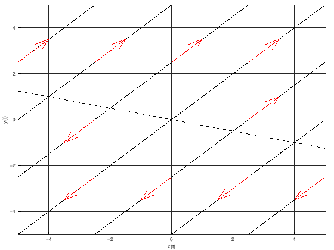

# Фазов портрет на автономна система

## Общ вид

Да се начертае фазов портрет на дадената автономната (тоест аргументът $t$ на функциите $x(t)$ и $y(t)$ не участва явно) система:

$$
\begin{cases}
\dot{x} = k_1x + k_2y + b_1 \newline
\dot{y} = k_3x + k_4y + b_2
\end{cases}
$$

$k_1, \space k_2, \space k_3, \space k_4, \space b_1, \space b_2 \in \mathbb{R}$

Обикновено в такива задачи $b_1 = b_2 = 0$ за простота.

Двата реда от дясната страна на равенствата са линейно зависими.

**ТУК ПОЛУЧАВАМЕ ЦЯЛА ПРАВА ОТ РАВНОВЕСНИ ТОЧКИ**

## Алгоритъм за решаване

Намираме равновесните точки на автономната система. Намираме ги от решенията на следната система:

$$
\begin{cases}
k_1x + k_2y + b_1 = 0 \newline
k_3x + k_4y + b_2 = 0
\end{cases}
$$

Редовете са линейно зависими и единият ред е ненужен.

Така получаваме цяла права от равновесни точки $y = -\frac{k_1}{k_2}x - \frac{b_1}{k_2}$

Намираме собствените стойности $\lambda_1, \lambda_2$ от

$$
P_A(\lambda) =
\begin{vmatrix}
    k_1 - \lambda & k_2 \newline
    k_3 & k_4 - \lambda
\end{vmatrix}
= 0
$$

Тъй като имаме линейно зависими редове, то ранкът на матрицата е непълен, съотвено ще получим, че едната собствена стойност е 0.

Намираме общите решения $x(t), y(t)$ на автономната хомогенна линейна система.

$$
\begin{cases}
x = C_1 + C_2e^{\lambda_2 t} \newline
y = m_1C_1 + m_2C_2e^{\lambda_2 t}
\end{cases}
$$

Изразяваме връзката между $x$ и $y$, като премахнем неавтономния елемент. Тоест изразяваме $C_2e^{\lambda_2 t}$ от едната страна на двете равенства и приравняваме получилото се. Ще получим, че $y = n_1x + C$, тоест, че фазовите криви са прави.

## Конкретен пример

Да се начертае фазов портрет на следната автономна система:

$$
\begin{cases}
\dot{x} = x + 4y \newline
\dot{y} = x + 4y
\end{cases}
$$

Намираме равновесните точки на автономната система. Тъй като тя е линейна, то очакваме да намерим точно 1 равновесна точка. Намираме ги от решенията на следната система:

$$
\begin{cases}
x + 4y = 0 \newline
x + 4y = 0
\end{cases}
$$

Редовете са линейно зависими и получаваме цяла права от равновесни точки $y = -\frac{1}{4}x$

$$
A =
\begin{pmatrix}
    1 & 4 \newline
    1 & 4
\end{pmatrix}
$$

Намираме собствените стойности $\lambda_1, \lambda_2$ от

$$
P_A(\lambda) =
\begin{vmatrix}
    1 - \lambda & 4 \newline
    1 & 4 - \lambda
\end{vmatrix}
= 0
$$

$$\lambda_1 = 0 \quad \lambda_2 = 5$$

Намираме общите решения на автономната хомогенна линейна система:

$$
\begin{cases}
    x = C_1 + C_2e^{5t}\\
    y = -\frac{1}{4}C_1 + C_2e^{5t}
\end{cases}
$$

За да можем да начертаем фазови криви в фазовата равнина (тоест равнина с оси $x(t)$ и $y(t)$, където нямаме ос $t$) е необходимо да премахнем неавтономния елемент $e^{5t}$

$$
\begin{cases}
    x - C_1 = C_2e^{5t}\\
    y + \frac{1}{4}C_1 = C_2e^{5t}
\end{cases}
$$

Откъдето

$$y + \frac{1}{4}C_1 = x - C_1$$

$$y = x - \frac{5}{4}C_1$$

$$y = x + K$$

Така получаваме, че фазовите криви са прави, успоредни на първи и трети квадрант.

Тангенциалните вектори се отдалечават от равновесната точка по правата им, защото всяка равновесна точка е неустойчива, понеже имаме една положителна собствена стойност.

Фазов портрет от Матлаб:

