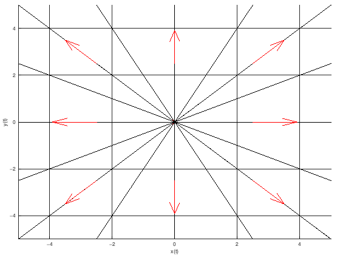

# Фазов портрет на автономна система

## Общ вид

Да се начертае фазов портрет на дадената автономната (тоест аргументът $t$ на функциите $x(t)$ и $y(t)$ не участва явно) система:

$$
\begin{cases}
\dot{x} = kx + b_1 \newline
\dot{y} = ky + b_2
\end{cases}
$$

$k, \space b_1, \space b_2 \in \mathbb{R}$

Обикновено в такива задачи $b_1 = b_2 = 0$ за простота.

Двата реда са независими, тоест в уравнението за $x$ не участва $y$ и обратното, а коефициентите пред $x$ и пред $y$ съвпадат.

**ИЗРОДÉН СЛУЧАЙ**

## Алгоритъм за решаване

Намираме равновесните точки на автономната система. Намираме ги от решенията на следната система:

$$
\begin{cases}
kx + b_1 = 0 \newline
ky + b_2 = 0
\end{cases}
$$

Получаваме равновесната точка $(x, y) = (-\frac{b_1}{k}, -\frac{b_2}{k})$

Ако равновесната точка не е $(0, 0)$, което се случва когато $(b_1, b_2) \ne (0, 0)$, то ще сменим базиса така, че равновесната точка да бъде $(0 ,0)$. Тогава полагаме $w = x + \frac{b_1}{k}$ и $z = y + \frac{b_2}{k}$ и получаваме системата:

$$
\begin{cases}
\dot{w} = kw \newline
\dot{z} = kz
\end{cases}
$$

(Ако не сме сменили базиса, то $w = x$ и $z = y$)

Единствената равновесна точка е $(0, 0)$.

Намираме общите решения $w(t), z(t)$. (Това са независими уравнения с разделени променливи)

$$
\begin{cases}
w = C_1e^{k t} \newline
z = C_2e^{k t}
\end{cases}
$$

Изразяваме връзката между $w$ и $z$, като премахнем неавтономния елемент. Тоест изразяваме $e^{k t}$ от едната страна на двете равенства и приравняваме получилото се. За да оставим $e^{k t}$ от дясната страна на равенствата обаче ще трябва да разделим на константите, което можем да го направим само ако те са нула. Тоест ще разгледаме 4 случая.

### I случай: $C_1 = C_2 = 0$

Тогава $(w, z) = (0, 0)$

### II случай: $C_1 = 0, \space C_2 \ne 0$

Тогава $(w, z) = (0, C_2 e^{kt})$

Гледаме поведението на $C_2 e^{kt}$ при $t \to \infty$

### III случай: $C_1 \ne 0, \space C_2 = 0$

Тогава $(x_1, y_1) = (C_1 e^{kt}, 0)$

Гледаме поведението на $C_1 e^{kt}$ при $t \to \infty$

### IV случай: $C_1 \ne 0, \space C_2 \ne 0$

Искаме да изразим връзката между $w$ и $z$ за някоe произволно $K \in \mathbb{R}$ и от изразяването определяме какви фазови криви чертаем.

Делим двата реда от системата с решения

$$\dfrac{z}{w} = \dfrac{C_2}{C_1}\dfrac{e^{kt}}{e^{kt}}$$

$$z = Kw$$

Това са прави, които минават през центъра на координатната система.

Така ще начертаем фазов портрет в базиса $(w, z)$. След това ще начертаем окончателен фазов портрет (транслиран) в базиса $(x, y)$.

## Конкретен пример

Да се начертае фазов портрет на следната автономна система:

$$
\begin{cases}
\dot{x} = 2x \newline
\dot{y} = 2y
\end{cases}
$$

Намираме равновесните точки на автономната система. Намираме ги от решенията на следната система:

$$
\begin{cases}
2x = 0 \newline
2y = 0
\end{cases}
$$

Единствената равновесна точка е $(0, 0)$ и няма нужда да сменяме базиса, въвеждайки $w$ и $z$

Намираме общите решения $x(t), y(t)$. (Това са независими уравнения с разделени променливи)

$$
\begin{cases}
x = C_1e^{2 t} \newline
y = C_2e^{2 t}
\end{cases}
$$

Проверяваме 4 случая

### I случай: $C_1 = C_2 = 0$

Тогава $(x, y) = (0, 0)$

### II случай: $C_1 = 0, \space C_2 \ne 0$

Тогава $(x, y) = (0, C_2 e^{2t})$

Правата $x=0$ без точката $(0, 0)$

Гледаме поведението на $C_2 e^{2t}$ при $t \to \infty$

$$C_2 e^{2t} \underset{t \to \infty}{\to} \begin{cases}+\infty \quad & C_2>0 \newline -\infty \quad & C_2<0\end{cases}$$

### III случай: $C_1 \ne 0, \space C_2 = 0$

Тогава $(x, y) = (C_1 e^{2t}, 0)$

Правата $y=0$ без точката $(0, 0)$

$$C_1 e^{2t} \underset{t \to \infty}{\to} \begin{cases}+\infty \quad & C_1>0 \newline -\infty \quad & C_1<0\end{cases}$$

### IV случай: $C_1 \ne 0, \space C_2 \ne 0$

Искаме да изразим връзката между $x$ и $y$ за някоe произволно $K \in \mathbb{R}$ и от изразяването определяме какви фазови криви чертаем.

Делим двата реда от системата с решения

$$\dfrac{y}{x} = \dfrac{C_2}{C_1}\dfrac{e^{2t}}{e^{2t}}$$

$$y = Kx$$

Това са прави, които минават през центъра на координатната система.

Фазов портрет от Матлаб:

