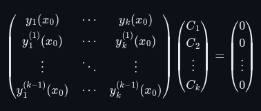

## Уравнения от първи ред

$Def$: $f(x, y)$ е липшицова по $y$ в $\Pi$, ако $\exists K > 0$, за което е изпълнено следното неравенство:

$$|f(x, y_1) - f(x, y_2)| \le K |y_1 - y_2|$$

където $(x, y_1), (x, y_2) \in \Pi$ са произволни.

$\textit{Лема}$: Ако $f(x, y), f_y'(x, y) \in C(\Pi) \implies f(x, y)$ е липшицова по $y$ в $\Pi$.

    
Доказателство

$f_y'(x, y) \in C(\Pi)$ и $\Pi$ е компакт $\implies$ $f_y'$ е ограничена в $\Pi$

Тоест $\exists K > 0 : |f_y'(x, y)| \le K \quad \forall (x, y) \in \Pi$

Нека $(x, y_1), (x, y_2) \in \Pi$ са произволни точки.

Нека за определеност $y_1 \le y_2$.

Нека разгледаме $I := \displaystyle\int\limits_{y_1}^{y_2}|f_y'(x, \lambda)|\mathrm{d}\lambda$. Ще изразим $I$ по два начина.

От една страна:

$$I = \displaystyle\int\limits_{y_1}^{y_2}\lvert f_y'(x, \lambda)\rvert\mathrm{d}\lambda$$

$$I = \lvert\displaystyle\int\limits_{y_1}^{y_2}f_y'(x, \lambda)\mathrm{d}\lambda\rvert$$

$$I = \lvert f(x, y_2) - f(x, y_1)\rvert$$

От друга страна:

$$I = \displaystyle\int\limits_{y_1}^{y_2}\mathrm{|}f_y'(x, \lambda)\mathrm{|}\mathrm{d}\lambda$$

$$I \le \displaystyle\int\limits_{y_1}^{y_2}K\mathrm{d}\lambda$$

$$I \le K(y_2 - y_1)$$

$$I \le K|y_2 - y_1|$$

Така

$$|f(x, y_2) - f(x, y_1)| \le K|y_2 - y_1|$$

$\implies f(x, y)$ е липшицова по $y$ в $\Pi$.

$$\Box \text{ край}$$

$$\newline$$

$\textit{Теорема}$ (Локална теорема за единственост и съществуване): Нека $f(x, y)$ е непрекъсната и липшицова по $y$ в $\Pi := \lbrace(x, y)\in\mathbb{R}:|x - x_0| \le a, |y-y_0| \le b\rbrace$.Тогава съществува единствено решение на задачата на Коши

$$\begin{cases}y' = f(x, y) \newline y(x_0) = y_0\end{cases}$$

в интервала $[x_0-h,x_0+h]$, където $h = \min \left\lbrace a, \dfrac{b}{M} \right\rbrace$ и $M = \displaystyle \max_{\Pi}|f(x, y)|$.

Идея за доказателство - чрез метод на Пикар.

$Def$: Точката $(x_0, y_0) \in D$ е обикновена точка за уравнението $f(x, y, y') = 0$, ако $f(x_0, y_0, z) = 0$ има краен брой различни и реални решения $z_1 < z_2 < \dots < z_m$ и $f'_z(x_0, y_0, z_j) \ne 0 \quad j = 1, 2, \dots, m$

$Def$: Точката $(x_0, y_0) \in D$ е особена точка за уравнението $f(x, y, y') = 0$, ако $f(x_0, y_0, z) = 0$ има реално решение $z_0$ и $f'_z(x_0, y_0, z_0) = 0$

$Def$: Решението на уравнението $f(x, y, y') = 0$ е особено, ако всички точки от графиката на решението са особени.

$\textit{Теорема}$ (Теорема за редукцията): Нека $(x_0, y_0) \in D$ е обикновена точка за уравнението $f(x, y, y') = 0$. Тогава в достатъчно малка околност $U \in D$ на точката $(x_0, y_0)$ съществуват функции $f_j(x, y) \quad j=1,2,\dots,m$ такива, че $f_j, (f_j)'_y \in C(U) \quad f_j(x_0, y_0) = z_j$ и всяко решение на задачата на Коши:

$$
\begin{cases}
f(x, y, y') = 0
\newline
f(x_0) = y_0
\end{cases}
$$

е решение на някоя от задачите на Коши:

$$
\begin{cases}
y' = f_j(x, y)
\newline
f(x_0) = y_0
\end{cases}
$$

## Уравнения от втори ред

## Линейни уравнения от по-висок ред

Линейно ОДУ от ред $n$ в най-общия смисъл има вида:

$$a_0(x)y^{(n)}(x) + a_1(x)y^{(n-1)}(x) + \dots + a_n(x)y(x) = f(x)$$

където $a_j(x)$ са комплекснозначни функции от вида:

$$g := a_j(x) = u(x) + \mathrm{i}v(x)$$

където $u: \Delta \rightarrow \mathbb{R}$ е реалната част на $g$ и $v: \Delta \rightarrow \mathbb{R}$ е имагинерната част на $g$.

$Def$: $g$ е непрекъсната в $\Delta$, ако функциите $u$ и $v$ са непрекъснати в $\Delta$.

$Def$: $g$ е диференцируема в $\Delta$, ако функциите $u$ и $v$ са диференцируеми в $\Delta$.

$Def$: $g$ е интегруема в $\Delta$, ако функциите $u$ и $v$ са интегруеми в $\Delta$.

$\textit{Означение}$: линейно ОДУ ще наричаме хомогенно, ако $f(x) \equiv 0$, иначе е нехомогенно

$\textit{Теорема}$: Решенията на хомогенно линейно ОДУ образуват **линейно пространство**.

    
Доказаелство

Нека $y_1, y_2$ са решение на уравнението и нека $\alpha, \beta \in \mathbb{C}$.

Ще покажем, че произволна линейна комбинация на 2 решения също е решение, тоест че $\alpha y_1 + \beta y_2$ е решение.

Заместваме в общия вид на хомогенното у-ние.

$$a_0(\alpha y_1 + \beta y_2)^{(n)} + \dots + a_n(\alpha y_1 + \beta y_2)$$

$$a_0(\alpha y_1^{(n)} + \beta y_2^{(n)}) + \dots + a_n(\alpha y_1 + \beta y_2)$$

$$\alpha(a_0 y_1^{(n)} + \dots + a_n y_1) + \beta(a_0 y_2^{(n)} + \dots + a_n y_2)$$

$$\alpha \times 0 + \beta \times 0 = 0$$

$\implies \alpha y_1 + \beta y_2$ е решение на хомогенното у-ние.

$\implies$ Решенията на у-нието образуват **линейно пространство**.

$$\Box \text{ край}$$

$$\newline$$

Нека $C_1, \dots, C_k \in \mathbb{C}$

$Def$: Функции $y_1, \dots, y_k$ са ЛНЗ в $\Delta$, ако от това, че $C_1y_1(x) + \dots + C_ky_k(x) = 0 \space \forall x \in \Delta$, следва, че $(C_1, \dots, C_k) = (0, \dots, 0)$.

$Def$: Функции $y_1, \dots, y_k$ са ЛЗ в $\Delta$, ако $C_1y_1(x) + \dots + C_ky_k(x) = 0$ за някое $x \in \Delta$ и $(C_1, \dots, C_k) \ne (0, \dots, 0)$.

$Def$: Детерминанта на Вронски на функциите $y_1, \dots, y_k \in C^{(k-1)}(\Delta)$ наричаме следната детерминанта:

$$
W(x) =
\begin{bmatrix}
y_1(x) & y_2(x) & \cdots & y_k(x)
\newline
y_1^{(1)}(x) & y_2^{(1)}(x) & \cdots & y_k^{(1)}(x)
\newline
\vdots  & \vdots  & \ddots & \vdots
\newline
y_1^{(k-1)}(x) & y_2^{(k-1)}(x) & \cdots & y_k^{(k-1)}(x)
\end{bmatrix}
$$

$\textit{Лема}$: Нека $y_1, \dots, y_k \in C^{(k-1)}(\Delta)$ са решение на хомогенно линейно ОДУ и нека $W$ е тяхната детерминанта на Вронски. Ако $\exists x_0 \in \Delta : W(x) \ne 0 \implies y_1, \dots, y_k$ са ЛНЗ в $\Delta$.

    
Доказателство

Нека $C_1, \dots, C_k \in \mathbb{C}$ са такива константи, че да е изпълнено следното равенство:

$$C_1y_1(x) + \dots + C_ky_k(x) = 0$$

Ще покажем, че $(C_1, \dots, C_k) = (0, \dots, 0)$, от което ще следва, че функциите са ЛНЗ.

Диференцираме $k-1$ брой пъти.

$$C_1y_1^{(1)}(x) + \dots + C_ky_k^{(1)}(x) = 0$$

$$\dots$$

$$C_1y_1^{(k-1)}(x) + \dots + C_ky_k^{(k-1)}(x) = 0$$

При $x = x_0$ получаваме следното матрично уравнение:

  

Детерминантата на матрицата вляво е детерминантата на Вронски, която по условие $W(x_0) \ne 0$.

Така уравнението има единствено решение при $(C_1, \dots, C_k) = (0, \dots, 0)$, от което следва че дадените функции са ЛНЗ в $\Delta$.

$$\Box \text{ край}$$

$$\newline$$

$\textit{Лема}$: Нека $y_1, \dots, y_k \in C^{(k-1)}(\Delta)$ са решение на хомогенно линейно ОДУ и нека $W$ е тяхната детерминанта на Вронски. Ако $\exists x_0 \in \Delta : W(x) = 0 \implies y_1, \dots, y_k$ са ЛЗ в $\Delta$.

    
Доказателство

Нека $C_1, \dots, C_k \in \mathbb{C}$ са такива константи, че да е изпълнено следното равенство:

$$C_1y_1(x) + \dots + C_ky_k(x) = 0$$

Диференцираме $k-1$ брой пъти.

$$C_1y_1^{(1)}(x) + \dots + C_ky_k^{(1)}(x) = 0$$

$$\dots$$

$$C_1y_1^{(k-1)}(x) + \dots + C_ky_k^{(k-1)}(x) = 0$$

При $x = x_0$ получаваме следното матрично уравнение:

  

Детерминантата на матрицата вляво е детерминантата на Вронски, която по условие $W(x_0) = 0$.

Оттук следва, че съществува решение на матричното уравнение от вида:

$$(\tilde{C_1}, \dots, \tilde{C_n}) \ne (0, \dots, 0)$$

Нека разгледаме функцията:

$$\eta(x) := \tilde{C_1}y_1 + \dots + \tilde{C_n}y_n$$

Ще покажем, че $\eta(x) = 0$ и по дефиниция функциите ще бъдат ЛЗ.

Знаем, че диференцирането е линейна операция и съответно $k$-тата производна ще има вида:

$$\eta^{(k)}(x) = \tilde{C_1}y_1^{(k)} + \dots + \tilde{C_n}y_n^{(k)}$$

Като заместим в матричното уравнение, получаваме следното:

$$\eta(x_0) = 0, \eta'(x_0) = 0, \dots, \eta^{(n-1)}(x_0) = 0$$

От условието знаем, че $y_1, \dots, y_k$ са решение на хомогенно линейно ОДУ и $\eta(x)$ бивайки тяхна линейна комбинация, също е решение на хомогенното линейно ОДУ.

Тоест:

$$a_0\eta^{(n)} + \dots + a_n\eta = 0$$

Така получаваме следната задача на Коши:

  

Очевидно $\eta(x) \equiv 0$ е решение на тази задача на Коши.

От теоремата за съществуване и единственос на решение следва, че $\eta(x) \equiv 0$, откъдето $y_1, \dots, y_k$ са ЛЗ.

$$\Box \text{ край}$$

$$\newline$$

$Def$: Решенията на хомогенно линейно ОДУ ще наричаме **ФСР** в $\Delta$, ако те са ЛНЗ.

$\textit{Лема}$ (Критерий за ФСР): Нека $y_1, \dots, y_k$ са решение на хомогенно ОДУ в $\Delta$ и нека $W$ е тяхната детерминанта на Вронски. Тогава следните твърдения са еквивалентни:

* $\exists x_0 \in \Delta : W(x_0) \ne 0$
* $y_1, \dots, y_k$ са ФСР в $\Delta$ на у-нието.
* $W(x) \ne 0 \quad \forall x \in \Delta$

$\textit{Теорема}$: Решенията на хомогенно линейно ОДУ $y_1, \dots, y_k$ образуват **линейно пространство** с размерност $k$. ($k$ на брой елементи от ФСР $\rightarrow$ ЛП с размерност $k$)

$\textit{Лема}$: Съществуват безброй много ФСР за хомогенно линейно ОДУ.

## Системи

Дадена е системата:

$$
\begin{cases}
\dot{x_1}(t) = a_{1,1}(t)x_1(t) + \dots + a_{1,n}(t)x_n(t) + f_1(t)
\newline
\dot{x_2}(t) = a_{2,1}(t)x_1(t) + \dots + a_{2,n}(t)x_n(t) + f_2(t)
\newline
\vdots
\newline
\dot{x_n}(t) = a_{n,1}(t)x_1(t) + \dots + a_{n,n}(t)x_n(t) + f_n(t)
\end{cases}
$$

Тази система можем да я рапишем с векторен запис:

$$\dot{\overrightarrow{x}}(t) = A(t)\overrightarrow{x}(t) + \overrightarrow{f}(t)$$

$\textit{Означение}$: Системата ще наричаме хомогенна, ако $\overrightarrow{f}(t) \equiv 0$, иначе е нехомогенна.

Нека хомогенната система има следните решения:

$$
\overrightarrow{\phi_1}(t)=
\begin{pmatrix}
\phi_1^1(t) \newline
\phi_1^2(t) \newline
\vdots \newline
\phi_1^n(t)
\end{pmatrix},
\overrightarrow{\phi_2}(t)=
\begin{pmatrix}
\phi_2^1(t) \newline
\phi_2^2(t) \newline
\vdots \newline
\phi_2^n(t)
\end{pmatrix},\dots,
\overrightarrow{\phi_n}(t)=
\begin{pmatrix}
\phi_n^1(t) \newline
\phi_n^2(t) \newline
\vdots \newline
\phi_n^n(t)
\end{pmatrix}
$$

$\textit{Теорема}$: Решенията на хомогенната система образуват **линейно пространство** с размерност $n$.

$Def$: Решенията на хомогенна система ще наричаме **ФСР**, ако те са ЛНЗ.

$Def$: Фундаментална матрица ще наричаме следната маатрица:

$$
\Phi =
\begin{pmatrix}
\phi_1^1(t) & \phi_2^1(t) & \cdots & \phi_n^1(t)
\newline
\phi_1^2(t) & \phi_2^2(t) & \cdots & \phi_n^2(t)
\newline
\vdots & \vdots & \ddots & \vdots
\newline
\phi_1^n(t) & \phi_2^n(t) & \cdots & \phi_n^n(t)
\end{pmatrix}
$$

$\textit{Свойство}$: Детерминантата на фундаменталната матрица е детерминантата на Вронски.

$\textit{Лема}$ (Критерий за ФСР): Нека $\overrightarrow{\phi_1}, \dots, \overrightarrow{\phi_n}$ са решения в $\Delta$ на хомогенна система и нека $W$ е тяхната детерминанта на Вронски. Тогава следните твърдения са еквивалентни:

* $\exists t_0 \in \Delta : W(t_0) \ne 0$
* $\overrightarrow{\phi_1}, \dots, \overrightarrow{\phi_n}$ са ФСР в $\Delta$ на системата.
* $W(t) \ne 0 \quad \forall x \in \Delta$

$Def$: Горната система ще наричаме автономна, ако не зависи явно от $t$.

Дадена е следната автономна система:

$$
\begin{cases}
\dot{x} = f(x, y)
\newline
\dot{y} = g(x, y)
\end{cases}
$$

$Def$: Равновесна точка наричаме всяко решение на следната система:

$$
\begin{cases}
f(x, y) = 0
\newline
g(x, y) = 0
\end{cases}
$$

$Def$: Интегрална крива ще наричаме кривата $\lbrace(x(t), y(t), t)\rbrace \quad t \in \Delta$.

$Def$: Фазова крива ще наричаме кривата $\lbrace(x(t), y(t))\rbrace \quad t \in \Delta$.

$\textit{Свойство}$: Фазовата крива е проекцията на интегралната крива в равнината $t = 0$.

$Def$: Фазов портрет на автономна система наричаме съвкупността от фазовите криви на системата.

$Def$: Равновесната точка $(a, b)$ е устойчива (по Ляпунов) за автономната система, ако за всяка нейна околност $U \subseteq D$ съществува нейна околност $V \subseteq U$ такава, че за всяко решение $(x(t), y(t))$ на системата, за което $(x_0, y_0) \in V$:

1) е дефинирано за $t \ge 0$
2) $(x(t), y(t)) \in U \quad \text{за } t \ge 0$

$Def$: Равновесната точка $(a, b)$ е асимптотично устойчива (по Ляпунов), ако е устойчива и $\displaystyle\lim_{t \to \infty}(x(t), y(t)) = (a, b)$.

$Def$: Равновесната точка $(a, b)$ е неустойчива, ако не е устойчива.

#### Класификация на равновесни точки

Разглеждаме системата:

$$
\begin{cases}
\dot{x}(t) = a_{11}x + a_{12}y + b_1
\newline
\dot{y}(t) = a_{21}x + a_{22}y + b_2
\end{cases}
$$

На системата съответства следната матрица:

$$
A=
\begin{pmatrix}
a_{11} & a_{12} \newline
a_{21} & a_{22}
\end{pmatrix}
$$

Нека тази матрица има ненулева детерминанта.

Собствените стойности $\lambda_{1}$ и $\lambda_{2}$ намираме от равенството $\text{det}(A - \lambda E) = 0$.

Класифицираме равновесната точка, решение на системата, според $\lambda_{1, 2}$ по следния начин:

1. $\lambda_{1, 2} \in \mathbb{R}$

* $\lambda_1 > 0$ и $\lambda_2 > 0 \implies$ неустойчив възел (неустойчива)

* $\lambda_1 < 0$ и $\lambda_2 < 0 \implies$ устойчив възел (асимптотично устойчива)

* $\lambda_1 > 0$ и $\lambda_2 < 0 \implies$ седло (неустойчива)

2. $\lambda_{1, 2} = \alpha \pm \mathrm{i}\beta \in \mathbb{C}$

* $\alpha > 0 \implies$ неустойчив фокус (неустойчива)

* $\alpha < 0 \implies$ устойчив фокус (асимптотично устойчива)

* $\alpha = 0 \implies$ център (устойчива)

$Def$: Линейно приближение/ Първо приближение на автономната система в околност на равновесната точка $(a, b)$ наричаме векторния запис:

$$
\begin{pmatrix}
\dot{x} \newline \dot{y}
\end{pmatrix} = J(a, b)
\begin{pmatrix}
x - a \newline y - b
\end{pmatrix}
$$

където

$$
J(x, y) =
\begin{pmatrix}
f'_x(x, y) & f'_y(x, y)
\newline
g'_x(x, y) & g'_y(x, y)
\end{pmatrix}
$$

$\textit{Теорема}$: Ако реалната част на *всички* собствени стойности на матрицата $J(a, b)$ е *отрицателна*, то точката $(a, b)$ е асимптотично устойчива.

$\textit{Теорема}$: Ако реалната част на *поне една* собствена стойност на матрицата $J(a, b)$ е *положителна*, то точката $(a, b)$ е неустойчива.

## Частни диференциални уравнения

---

## Други

$Def$: Функцията $f(x, y) \in C(\Delta)$ е хомогенна от степен $n$, ако $\forall (x, y) \in \Delta, \lambda \in \mathbb{R}$ е изпълнено следното равенство:

$$f(\lambda x, \lambda y) = \lambda^{n}f(x, y)$$

---

## Видове уравнения и задачи на Коши