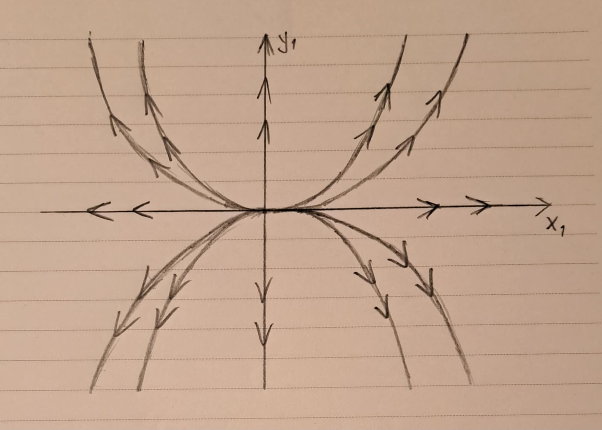
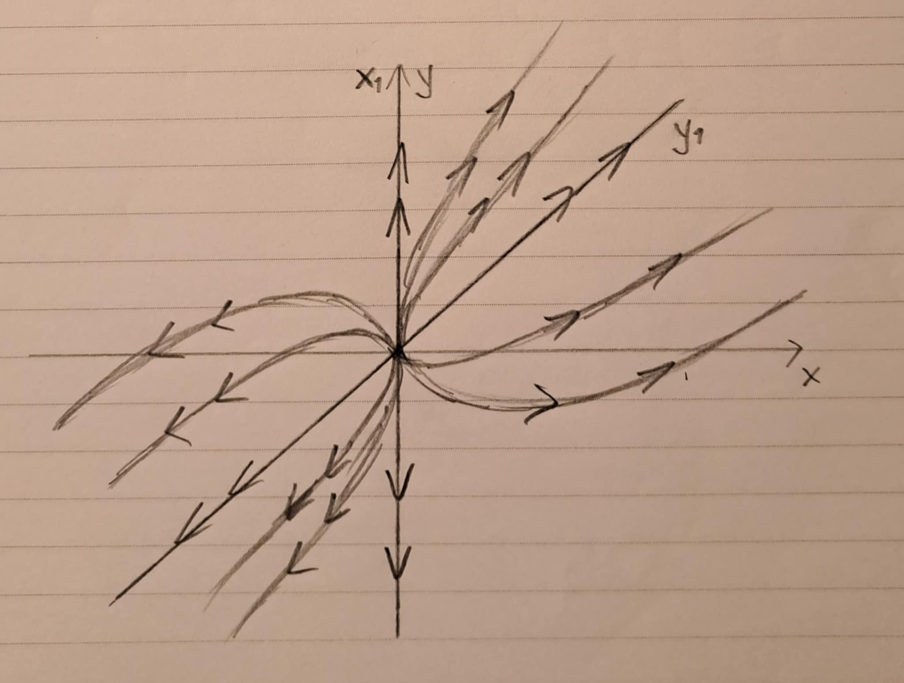
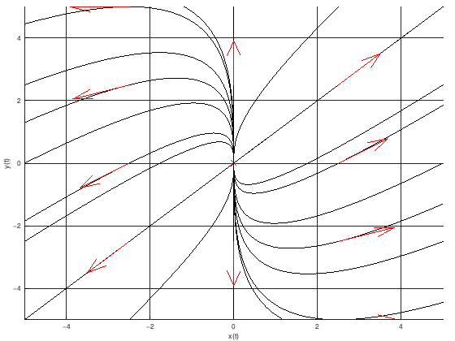
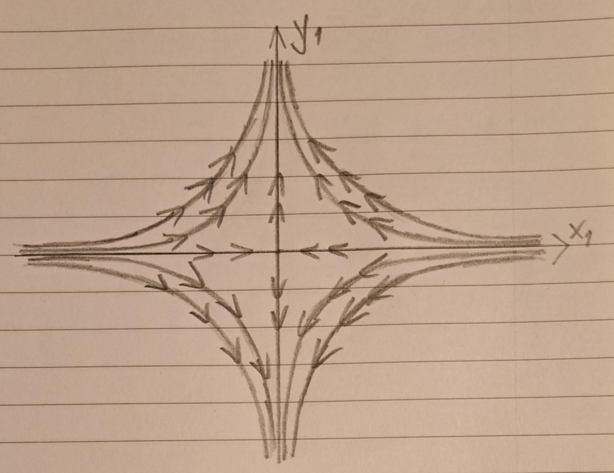
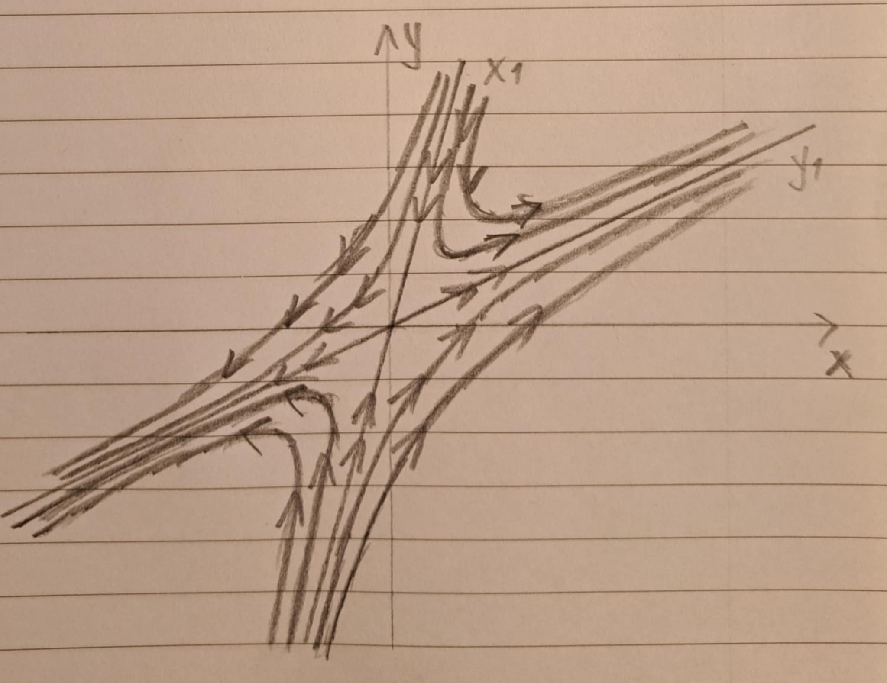
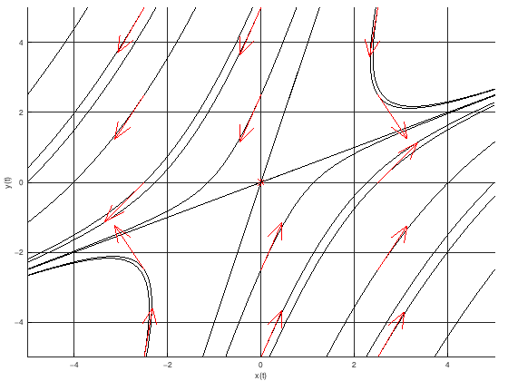
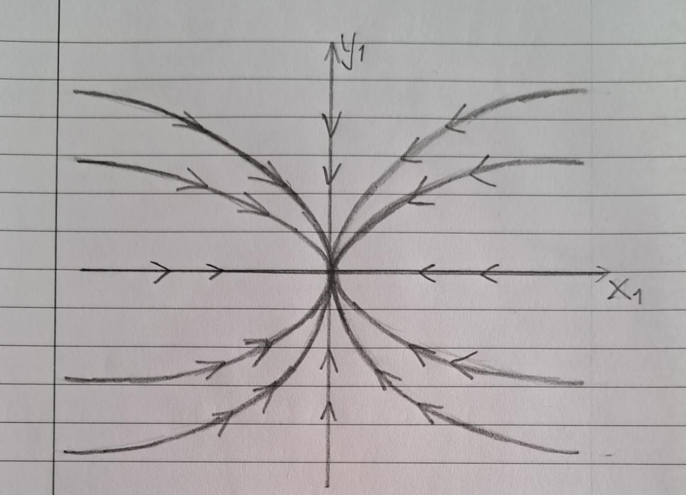
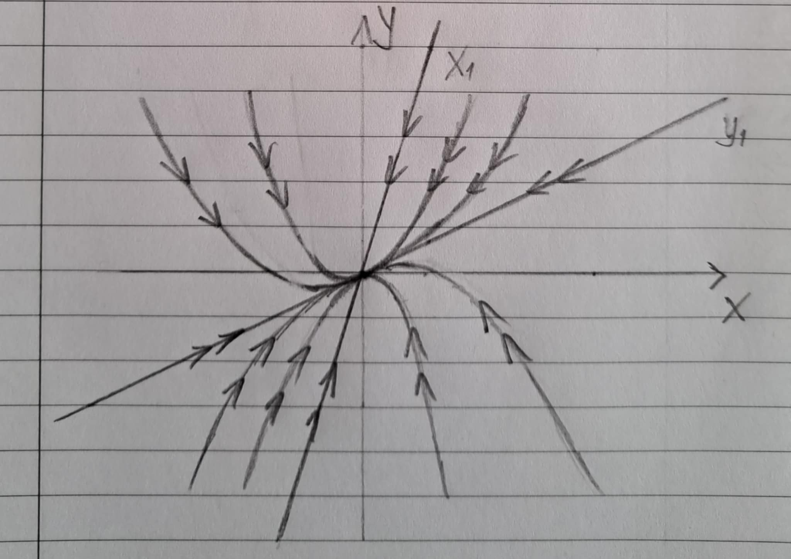
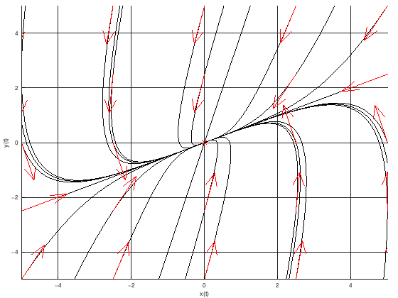

# Задачи за линейни уравнения и системи

## Задача 1

Решете уравнението

$$
y'' + 10y' + 34y = 5 e^x
$$

    
Решение

Нехомогенно линейно уравнение с дясна страна квазиполином.

Решението на даденото уравнение се задава:

$$y = y_0 + y_1$$

където

* $y_0$ е общото решение на хомогенното уравнение
* $y_1$ е едно частно решение на нехомогенното уравнение

**I стъпка** намираме $y_0$

На хомогенното уравнение съпоставяме характеристичния полином

$$P(\lambda) = \lambda^2 + 10\lambda + 34 = 0$$

$$\lambda_{1, 2} = -5 \pm 3i$$

$$\text{ФСР} = \left\lbrace e^{-5x}\cos{(3x)}, \space e^{-5x}\sin{(3x)} \right\rbrace$$

$$y_0 = C_1 e^{-5x}\cos{(3x)} + C_2 e^{-5x}\sin{(3x)}$$

**II стъпка** намираме $y_1$

Квазиполиномът от нехомогенната част на уравнението има вида

$$L_k(x) e^{\alpha x} = 5 e^{x}$$

където

* $\alpha = 1$ е коефициентът пред степента на експонентата
* $k = 0$ е алгебричната степен на полинома

Нека с $s$ бележим колко пъти $\alpha$ е кратен на характеристичния полином $P(\alpha)$. Така $s = 0$

Тогава частно решение на нехогенното уравнение има вида:

$$y_1 = Q_k(x) x^s e^{\alpha x} = Q_0(x) x^0 e^{1 x} = a e^{x}$$

Заместваме с $y_1$ и нейните производни във нехомогенното уравнение

$$a e^{x} + 10 a e^{x} + 34 a e^{x} = 5 e^{x}$$

$$a = \dfrac{1}{9}$$

Така

$$y_1 = \dfrac{1}{9} e^{x}$$

**III стъпка** намираме $y$

$$y = y_0 + y_1 = C_1 e^{-5x}\cos{(3x)} + C_2 e^{-5x}\sin{(3x)} + \dfrac{1}{9} e^{x}$$

---

## Задача 2

Решете уравнението

$$
y'' + 10y' + 25y = 250x
$$

    
Решение

Нехомогенно линейно уравнение с дясна страна квазиполином.

Решението на даденото уравнение се задава:

$$y = y_0 + y_1$$

където

* $y_0$ е общото решение на хомогенното уравнение
* $y_1$ е едно частно решение на нехомогенното уравнение

**I стъпка** намираме $y_0$

На хомогенното уравнение съпоставяме характеристичния полином

$$P(\lambda) = \lambda^2 + 10\lambda + 25 = 0$$

$$\lambda_{1, 2} = -5$$

$$\text{ФСР} = \left\lbrace e^{-5x}, \space xe^{-5x} \right\rbrace$$

$$y_0 = C_1 e^{-5x} + C_2 x e^{-5x}$$

**II стъпка** намираме $y_1$

Квазиполиномът от нехомогенната част на уравнението има вида

$$L_k(x) e^{\alpha x} = 250x$$

където

* $\alpha = 0$ е коефициентът пред степента на експонентата
* $k = 1$ е алгебричната степен на полинома

Нека с $s$ бележим колко пъти $\alpha$ е кратен на характеристичния полином $P(\alpha)$. Така $s = 0$

Тогава частно решение на нехогенното уравнение има вида:

$$y_1 = Q_k(x) x^s e^{\alpha x} = Q_1(x) x^0 e^{0 x} = ax + b$$

Заместваме с $y_1$ и нейните производни във нехомогенното уравнение

$$10 a + 25ax + 25b = 250x$$

Получаваме системата

$$25 a = 250$$

$$10a + 25b = 0$$

Откъдето

$$a = 10, \quad b = -4$$

Така

$$y_1 = 10 x - 4$$

**III стъпка** намираме $y$

$$y = y_0 + y_1 = C_1 e^{-5x} + C_2 x e^{-5x} + 10x - 4$$

---

## Задача 3

Решете уравнението

$$
2y'' + y' - y = 1
$$

    
Решение

Нехомогенно линейно уравнение с дясна страна квазиполином.

Решението на даденото уравнение се задава:

$$y = y_0 + y_1$$

където

* $y_0$ е общото решение на хомогенното уравнение
* $y_1$ е едно частно решение на нехомогенното уравнение

**I стъпка** намираме $y_0$

На хомогенното уравнение съпоставяме характеристичния полином

$$P(\lambda) = 2\lambda^2 + \lambda - 1 = 0$$

$$\lambda_{1} = -1; \quad \lambda_{2} = \frac{1}{2}$$

$$\text{ФСР} = \left\lbrace e^{-x}, \space e^{\frac{1}{2}x} \right\rbrace$$

$$y_0 = C_1 e^{-x} + C_2 e^{\frac{1}{2}x}$$

**II стъпка** намираме $y_1$

Квазиполиномът от нехомогенната част на уравнението има вида

$$L_k(x) e^{\alpha x} = 1$$

където

* $\alpha = 0$ е коефициентът пред степента на експонентата
* $k = 0$ е алгебричната степен на полинома

Нека с $s$ бележим колко пъти $\alpha$ е кратен на характеристичния полином $P(\alpha)$. Така $s = 0$

Тогава частно решение на нехогенното уравнение има вида:

$$y_1 = Q_k(x) x^s e^{\alpha x} = Q_0(x)x^0e^{0x} = a$$

Заместваме с $y_1$ и нейните производни във нехомогенното уравнение

$$- a = 1$$

$$a = -1$$

Така

$$y_1 = -1$$

**III стъпка** намираме $y$

$$y = y_0 + y_1 = C_1 e^{-x} + C_2 e^{\frac{1}{2}x} - 1$$

---

## Задача 4

Решете уравнението

$$2y'' - y' - 3y + 1 = 0$$

    
Решение

$$2y'' - y' - 3y = -1$$

Нехомогенно линейно уравнение с дясна страна квазиполином.

Решението на даденото уравнение се задава:

$$y = y_0 + y_1$$

където

* $y_0$ е общото решение на хомогенното уравнение
* $y_1$ е едно частно решение на нехомогенното уравнение

**I стъпка** намираме $y_0$

На хомогенното уравнение съпоставяме характеристичния полином

$$P(\lambda) = 2\lambda^2 - \lambda - 3 = 0$$

$$\lambda_{1} = -1; \quad \lambda_{2} = \frac{3}{2}$$

$$\text{ФСР} = \left\lbrace e^{-x}, \space e^{\frac{3}{2}x} \right\rbrace$$

$$y_0 = C_1 e^{-x} + C_2 e^{\frac{3}{2}x}$$

**II стъпка** намираме $y_1$

Квазиполиномът от нехомогенната част на уравнението има вида

$$L_k(x) e^{\alpha x} = -1$$

където

* $\alpha = 0$ е коефициентът пред степента на експонентата
* $k = 0$ е алгебричната степен на полинома

Нека с $s$ бележим колко пъти $\alpha$ е кратен на характеристичния полином $P(\alpha)$. Така $s = 0$

Тогава частно решение на нехогенното уравнение има вида:

$$y_1 = Q_k(x) x^s e^{\alpha x} = Q_0(x)x^0e^{0x} = a$$

Заместваме с $y_1$ и нейните производни във нехомогенното уравнение

$$-3 a = -1$$

$$a = \dfrac{1}{3}$$

Така

$$y_1 = \dfrac{1}{3}$$

**III стъпка** намираме $y$

$$y = y_0 + y_1 = C_1 e^{-x} + C_2 e^{\frac{3}{2}x} + \dfrac{1}{3}$$

---

## Задача 5

Решете уравнението

$$y'' - 2y' + y = \dfrac{e^x}{x}$$

    
Решение

Нехомогенно линейно уравнение с дясна страна произволна функция.

Решението на даденото уравнение се задава:

$$y = y_0 + y_1$$

където

* $y_0$ е общото решение на хомогенното уравнение
* $y_1$ е едно частно решение на нехомогенното уравнение

**I стъпка** намираме $y_0$

На хомогенното уравнение съпоставяме характеристичния полином

$$P(\lambda) = \lambda^2 - 2\lambda + 1 = 0$$

$$\lambda_{1, 2} = 1$$

$$\text{ФСР} = \left\lbrace e^{x}, \space xe^{x} \right\rbrace$$

$$y_0 = C_1 e^{x} + C_2 xe^{x}$$

**II стъпка** намираме $y_1$

Ще приложим метода на Лагранж, който гласи, че частно решение на нехомогенното уравнение има вида:

$$y_1 = b_1(x)e^x + b_2(x) x e^x$$

където $b_1, b_2 \in C^1(\Delta)$ са произволни диференцируеми функции, за които са изпълнени следните условия:

$$b_1' e^x + b_2' xe^x = 0$$

$$b_1' (e^x)' + b_2' (xe^x)' = \frac{f(x)}{a}$$

където $a = 1$ е коефициентът пред най-старшата производна и $f(x)$ е произволната функция от дясната страна на уравнението.

Системата има вида:

$$b_1' e^x + b_2' xe^x = 0$$

$$b_1' e^x + b_2' e^x (1 + x) = \frac{e^x}{x}$$

Делим на $e^x \ne 0$

$$b_1' + b_2' x = 0$$

$$b_1' + b_2' + b_2' x = \frac{1}{x}$$

Получаваме

$$b_1' = -1$$

$$b_2' = \dfrac{1}{x}$$

Интегрираме по $x$

$$b_1 = -x + K_1$$

$$b_2 = \ln{|x|} + K_2$$

Функциите $b_1$ и $b_2$ са произволни и съответно можем да фиксираме $K_1$ и $K_2$. Нека $K_1 = K_2 = 0$

$$b_1 = -x$$

$$b_2 = \ln{|x|}$$

С намерените функции $b_1$ и $b_2$ заместваме в $y_1$

$$y_1 = -xe^x + \ln{|x|} x e^x = xe^x (\ln{|x| - 1})$$

**III стъпка** намираме $y$

$$y = y_0 + y_1 = C_1 e^{x} + C_2 xe^{x} + xe^x (\ln{|x| - 1})$$

$$y = C_1 e^{x} + (C_2 - 1) xe^{x} + xe^x \ln{|x|}$$

$$y = C_1 e^{x} + C_2^* xe^{x} + xe^x \ln{|x|}$$

---

## Задача 6

Решете уравнението

$$x^2y'' + xy' + 9y = 3\cot{(3 \ln{x})}$$

    
Решение

Уравнение на Ойлер.

Прилагаме стандартните полгания за уравнение от този тип и получаваме:

$$z'' + 9z = 3\cot{(3t)}$$

Нехомогенно линейно уравнение с дясна страна произволна функция.

Решението на даденото уравнение се задава:

$$z = z_0 + z_1$$

където

* $z_0$ е общото решение на хомогенното уравнение
* $z_1$ е едно частно решение на нехомогенното уравнение

**I стъпка** намираме $z_0$

На хомогенното уравнение съпоставяме характеристичния полином

$$P(\lambda) = \lambda^2 + 9 = 0$$

$$\lambda_{1, 2} = -3i$$

$$\text{ФСР} = \left\lbrace \cos{(3t)}, \space \sin{(3t)} \right\rbrace$$

$$z_0 = C_1 \cos{(3t)} + C_2 \sin{(3t)}$$

**II стъпка** намираме $z_1$

Ще приложим метода на Лагранж, който гласи, че частно решение на нехомогенното уравнение има вида:

$$z_1 = b_1(t)\cos{(3t)} + b_2(t) \sin{(3t)}$$

където $b_1, b_2 \in C^1(\Delta)$ са произволни диференцируеми функции, за които са изпълнени следните условия:

$$b_1' \cos{(3t)} + b_2' \sin{(3t)} = 0$$

$$b_1' (\cos{(3t)})' + b_2' (\sin{(3t)})' = \frac{f(x)}{a}$$

където $a = 1$ е коефициентът пред най-старшата производна и $f(x)$ е произволната функция от дясната страна на уравнението.

Системата има вида:

$$b_1' \cos{(3t)} + b_2' \sin{(3t)} = 0$$

$$-3b_1' \sin{(3t)} + 3b_2' \cos{(3t)} = 3\frac{\cos{(3t)}}{\sin{(3t)}}$$

След еквивалентни преобразувания на алгебричната система получаваме:

$$b_1' = -\cos{(3t)}$$

$$b_2' = \dfrac{\cos^2{(3t)}}{\sin{(3t)}}$$

Интегрираме по $t$

$$b_1 = -\dfrac{1}{3}\sin{(3t)} + K_1$$

$$b_2 = \dfrac{1}{3}\cos{(3t)} + \dfrac{1}{6}\ln{\left|\dfrac{1-\cos{(3t)}}{1+\cos{(3t)}}\right|} + K_2$$

Функциите $b_1$ и $b_2$ са произволни и съответно можем да фиксираме $K_1$ и $K_2$. Нека $K_1 = K_2 = 0$

$$b_1 = -\dfrac{1}{3}\sin{(3t)}$$

$$b_2 = \dfrac{1}{3}\cos{(3t)} + \dfrac{1}{6}\ln{\left|\dfrac{1-\cos{(3t)}}{1+\cos{(3t)}}\right|}$$

С намерените функции $b_1$ и $b_2$ заместваме в $z_1$

$$z_1 = -\dfrac{1}{3}\sin{(3t)}\cos{(3t)} + \left(\dfrac{1}{3}\cos{(3t)} + \dfrac{1}{6}\ln{\left|\dfrac{1-\cos{(3t)}}{1+\cos{(3t)}}\right|}\right) \sin{(3t)}$$

$$z_1 = \dfrac{1}{6}\ln{\left|\dfrac{1-\cos{(3t)}}{1+\cos{(3t)}}\right|}\sin{(3t)}$$

**III стъпка** намираме $z$

$$z = z_0 + z_1 = C_1 \cos{(3t)} + C_2 \sin{(3t)} + \dfrac{1}{6}\ln{\left|\dfrac{1-\cos{(3t)}}{1+\cos{(3t)}}\right|}\sin{(3t)}$$

Така решихме положеното уравнение. Остава да върнем полаганията, за да получим решението на уравнението на Ойлер.

$$y = C_1 \cos{(3\ln{x})} + C_2 \sin{(3\ln{x})} + \dfrac{1}{6}\ln{\left|\dfrac{1-\cos{(3\ln{x})}}{1+\cos{(3\ln{x})}}\right|}\sin{(3\ln{x})}$$

---

## Задача 7

Решете уравнението

$$(x-1)^2y'' + 3(x-1)y' + 5y = 16(x-1)\ln{(x-1)}$$

    
Решение

Уравнение на Ойлер.

Прилагаме стандартните полгания за уравнение от този тип и получаваме:

$$z'' + 2z' + 5z = 16te^t$$

Нехомогенно линейно уравнение с дясна страна квазиполином.

Решението на даденото уравнение се задава:

$$z = z_0 + z_1$$

където

* $z_0$ е общото решение на хомогенното уравнение
* $z_1$ е едно частно решение на нехомогенното уравнение

**I стъпка** намираме $z_0$

На хомогенното уравнение съпоставяме характеристичния полином

$$P(\lambda) = \lambda^2 + 2\lambda + 5 = 0$$

$$\lambda_{1, 2} = -1 \pm 2i$$

$$\text{ФСР} = \left\lbrace e^{-t}\cos{(2t)}, \space e^{-t}\sin{(2t)} \right\rbrace$$

$$z_0 = C_1 e^{-t}\cos{(2t)} + C_2 e^{-t}\sin{(2t)}$$

**II стъпка** намираме $z_1$

Квазиполиномът от нехомогенната част на уравнението има вида

$$L_k(t) e^{\alpha x} = 16te^{t}$$

където

* $\alpha = 1$ е коефициентът пред степента на експонентата
* $k = 1$ е алгебричната степен на полинома

Нека с $s$ бележим колко пъти $\alpha$ е кратен на характеристичния полином $P(\alpha)$. Така $s = 0$

Тогава частно решение на нехогенното уравнение има вида:

$$z_1 = Q_k(t) t^s e^{\alpha t} = Q_1(t) t^0 e^{1 t} = (at + b)e^{t}$$

$$z_1 = (at + b)e^{t}$$

$$z_1' = (at + a + b)e^{t}$$

$$z_1'' = (at + 2a + b)e^{t}$$

Заместваме с $y_1$ и нейните производни във нехомогенното уравнение

$$(at + 2a + b)e^{t} + 2(at + a + b)e^{t} + 5 (at + b)e^{t} = 16te^t$$

Делим на $e^t \ne 0$

$$(at + 2a + b) + 2(at + a + b) + 5 (at + b) = 16t$$

$$8at + 4a + 8b = 16t$$

Получаваме системата

$$8 a = 16$$

$$4a + 8b = 0$$

Откъдето

$$a = 2, \quad b = -1$$

Така

$$z_1 = (2t - 1)e^t$$

**III стъпка** намираме $z$

$$z = z_0 + z_1 = C_1 e^{-t}\cos{(2t)} + C_2 e^{-t}\sin{(2t)} + (2t - 1)e^t$$

Така решихме положеното уравнение. Остава да върнем полаганията, за да получим решението на уравнението на Ойлер.

$$y = C_1 e^{-\ln{(x-1)}}\cos{(2\ln{(x-1)})} + C_2 e^{-\ln{(x-1)}}\sin{(2\ln{(x-1)})} + (2\ln{(x-1)} - 1)e^{\ln{(x-1)}}$$

---

## Задача 8

Решете уравнението

$$(x-2)^2y'' - (x-1)y' + 5y = -4(x-2)\ln{(x-2)}$$

    
Решение

Уравнение на Ойлер.

Прилагаме стандартните полгания за уравнение от този тип и получаваме:

$$z'' - 2z' + 5z = -4te^t$$

Нехомогенно линейно уравнение с дясна страна квазиполином.

Решението на даденото уравнение се задава:

$$z = z_0 + z_1$$

където

* $z_0$ е общото решение на хомогенното уравнение
* $z_1$ е едно частно решение на нехомогенното уравнение

**I стъпка** намираме $z_0$

На хомогенното уравнение съпоставяме характеристичния полином

$$P(\lambda) = \lambda^2 - 2\lambda + 5 = 0$$

$$\lambda_{1, 2} = 1 \pm 2i$$

$$\text{ФСР} = \left\lbrace e^{t}\cos{(2t)}, \space e^{t}\sin{(2t)} \right\rbrace$$

$$z_0 = C_1 e^{t}\cos{(2t)} + C_2 e^{t}\sin{(2t)}$$

**II стъпка** намираме $z_1$

Квазиполиномът от нехомогенната част на уравнението има вида

$$L_k(t) e^{\alpha x} = -4te^{t}$$

където

* $\alpha = 1$ е коефициентът пред степента на експонентата
* $k = 1$ е алгебричната степен на полинома

Нека с $s$ бележим колко пъти $\alpha$ е кратен на характеристичния полином $P(\alpha)$. Така $s = 0$

Тогава частно решение на нехогенното уравнение има вида:

$$z_1 = Q_k(t) t^s e^{\alpha t} = Q_1(t) t^0 e^{1 t} = (at + b)e^{t}$$

$$z_1 = (at + b)e^{t}$$

$$z_1' = (at + a + b)e^{t}$$

$$z_1'' = (at + 2a + b)e^{t}$$

Заместваме с $y_1$ и нейните производни във нехомогенното уравнение

$$(at + 2a + b)e^{t} - 2(at + a + b)e^{t} + 5 (at + b)e^{t} = -4te^t$$

Делим на $e^t \ne 0$

$$(at + 2a + b) - 2(at + a + b) + 5 (at + b) = -4t$$

$$4at + 4b = -4t$$

Получаваме системата

$$4 a = -4$$

$$4b = 0$$

Откъдето

$$a = -1, \quad b = 0$$

Така

$$z_1 = -te^t$$

**III стъпка** намираме $z$

$$z = z_0 + z_1 = C_1 e^{t}\cos{(2t)} + C_2 e^{t}\sin{(2t)} - te^t$$

Така решихме положеното уравнение. Остава да върнем полаганията, за да получим решението на уравнението на Ойлер.

$$y = C_1 e^{\ln{(x-2)}}\cos{(2\ln{(x-2)})} + C_2 e^{\ln{(x-2)}}\sin{(2\ln{(x-2)})} - \ln{(x-2)}e^{\ln{(x-2)}}$$

---

## Задача 9

Решете системата

$$
\begin{cases}
    \dot{x} = -4x - y + e^t\\
    \dot{y} = -x -4y
\end{cases}
$$

    
Решение

Линейна система с нехомогенна част квазиполином.

Решенията на дадената система се задават:

$$x = x_0 + x_1$$

$$y = y_0 + y_1$$

където

* $x_0, y_0$ са общите решения на хомогенната система
* $x_1, y_1$ са частни решения на нехомогенната система

**I стъпка** намираме $x_0, y_0$

На хомогенната система съпоставяме характеристичния полином

$$P_A(\lambda) = \lambda^2 + 8\lambda + 15 = 0$$

$$\lambda_{1} = -3, \quad \lambda_{2} = -5$$

$$\text{ФСР} = \left\lbrace e^{-3t}, \space e^{-5t} \right\rbrace$$

Така

$$x_0 = C_1 e^{-3t} + C_2 e^{-5t}$$

$$y_0 = C_3 e^{-3t} + C_4 e^{-5t}$$

Получаваме 4 константи, а 2 са достатъчни. Ще елиминираме 2 от тях като заместим с $x_0, y_0, \dot{x_0}$ в първия ред на хомогенната система.

$$\dot{x_0} = -4x_0 - y_0$$

$$-3 C_1 e^{-3t} - 5 C_2 e^{-5t} = -4(C_1 e^{-3t} + C_2 e^{-5t}) - (C_3 e^{-3t} + C_4 e^{-5t})$$

$$-3 C_1 e^{-3t} - 5 C_2 e^{-5t} = (-4 C_1 - C_3)e^{-3t} + (-4 C_2 - C_4)e^{-5t}$$

Получаваме системата

$$-3C_1 = -4 C_1 - C_3$$

$$-5C_2 = - 4 C_2 - C_4$$

Откъдето

$$C_3 = -C_1$$

$$C_4 = C_2$$

Така

$$x_0 = C_1 e^{-3t} + C_2 e^{-5t}$$

$$y_0 = -C_1 e^{-3t} + C_2 e^{-5t}$$

**II стъпка** намираме $x_1, y_1$

Квазиполиномите от нехомогенната част на системата са

$$e^t; \quad 0e^t$$

и имат вида

$$L_{k_1}(t) e^{\alpha t}; \quad L_{k_2}(t) e^{\alpha t}$$

където

* $\alpha = 1$ е коефициентът пред степента на експонентата
* $k_1 = 0$ е алгебричната степен на първия полинома
* $k_2 = 0$ е алгебричната степен на втория полинома

Нека с $s$ бележим колко пъти $\alpha$ е кратен на характеристичния полином $P(\alpha)$. Така $s = 0$

Тогава частните решения на нехогенната система има вида:

$$x_1 = Q_{k_1}(t) t^s e^{\alpha t} = Q_0(t) t^0 e^{1 t} = a e^{t}$$

$$y_1 = M_{k_2}(t) t^s e^{\alpha t} = M_0(t) t^0 e^{1 t} = b e^{t}$$

Заместваме с $x_1, y_1, \dot{x_1}, \dot{y_1}$ в нехомогенната система

$$ae^t = -4ae^t - be^t + e^t$$

$$be^t = -ae^t - 4be^t$$

Делим на $e^t \ne 0$ и получаваме алгебричната система

$$a = -4a - b + 1$$

$$b = -a - 4b$$

Решенията на тази система са

$$(a, b) = \left(\dfrac{5}{24}, -\dfrac{1}{24}\right)$$

Така

$$x_1 = \dfrac{5}{24} e^{t}$$

$$y_1 = -\dfrac{1}{24} e^{t}$$

**III стъпка** намираме $x, y$

$$x = x_0 + x_1 = C_1 e^{-3t} + C_2 e^{-5t} + \dfrac{5}{24} e^{t}$$

$$y = y_0 + y_1 = -C_1 e^{-3t} + C_2 e^{-5t} - \dfrac{1}{24} e^{t}$$

---

## Задача 10

Решете системата

$$
\begin{cases}
    \dot{x} = 3x + e^{-t}\\
    \dot{y} = 2x + y
\end{cases}
$$

    
Решение

Линейна система с нехомогенна част квазиполином.

Решенията на дадената система се задават:

$$x = x_0 + x_1$$

$$y = y_0 + y_1$$

където

* $x_0, y_0$ са общите решения на хомогенната система
* $x_1, y_1$ са частни решения на нехомогенната система

**I стъпка** намираме $x_0, y_0$

На хомогенната система съпоставяме характеристичния полином

$$P_A(\lambda) = \lambda^2 - 4\lambda + 3 = 0$$

$$\lambda_{1} = 1, \quad \lambda_{2} = 3$$

$$\text{ФСР} = \left\lbrace e^{t}, \space e^{3t} \right\rbrace$$

Така

$$x_0 = C_1 e^{t} + C_2 e^{3t}$$

$$y_0 = C_3 e^{t} + C_4 e^{3t}$$

Получаваме 4 константи, а 2 са достатъчни. Ще елиминираме 2 от тях като заместим с $x_0, y_0, \dot{y_0}$ във втория ред на хомогенната система.

$$\dot{y_0} = 2x_0 + y_0$$

$$C_3 e^{t} + 3 C_4 e^{3t} = 2(C_1 e^{t} + C_2 e^{3t}) + (C_3 e^{t} + C_4 e^{3t})$$

$$C_3 e^{t} + 3 C_4 e^{3t} = (2 C_1 + C_3)e^{t} + (2 C_2 + C_4)e^{3t}$$

Получаваме системата

$$C_3 = 2 C_1 + C_3$$

$$3C_4 = 2 C_2 + C_4$$

Откъдето

$$C_1 = 0$$

$$C_4 = C_2$$

Така

$$x_0 = C_2 e^{3t}$$

$$y_0 = C_3 e^{t} + C_2 e^{3t}$$

**II стъпка** намираме $x_1, y_1$

Квазиполиномите от нехомогенната част на системата са

$$e^{-t}; \quad 0e^{-t}$$

и имат вида

$$L_{k_1}(t) e^{\alpha t}; \quad L_{k_2}(t) e^{\alpha t}$$

където

* $\alpha = -1$ е коефициентът пред степента на експонентата
* $k_1 = 0$ е алгебричната степен на първия полинома
* $k_2 = 0$ е алгебричната степен на втория полинома

Нека с $s$ бележим колко пъти $\alpha$ е кратен на характеристичния полином $P(\alpha)$. Така $s = 0$

Тогава частните решения на нехогенната система има вида:

$$x_1 = Q_{k_1}(t) t^s e^{\alpha t} = Q_0(t) t^0 e^{-1 t} = a e^{-t}$$

$$y_1 = M_{k_2}(t) t^s e^{\alpha t} = M_0(t) t^0 e^{-1 t} = b e^{-t}$$

Заместваме с $x_1, y_1, \dot{x_1}, \dot{y_1}$ в нехомогенната система

$$-ae^{-t} = 3ae^{-t} + e^{-t}$$

$$-be^{-t} = 2ae^{-t} + be^{-t}$$

Делим на $e^{-t} \ne 0$ и получаваме алгебричната система

$$-a = 3a + 1$$

$$-b = 2a + b$$

Решенията на тази система са

$$(a, b) = \left(-\dfrac{1}{4}, \dfrac{1}{4}\right)$$

Така

$$x_1 = -\dfrac{1}{4} e^{-t}$$

$$y_1 = \dfrac{1}{4} e^{-t}$$

**III стъпка** намираме $x, y$

$$x = x_0 + x_1 = C_2 e^{3t} - \dfrac{1}{4} e^{-t}$$

$$y = y_0 + y_1 = C_3 e^{t} + C_2 e^{3t} + \dfrac{1}{4} e^{-t}$$

---

## Задача 11

Решете системата

$$
\begin{cases}
    \dot{x} = 3x + e^{-2t}\\
    \dot{y} = 2x + y - e^{-2t}
\end{cases}
$$

    
Решение

Линейна система с нехомогенна част квазиполином.

Решенията на дадената система се задават:

$$x = x_0 + x_1$$

$$y = y_0 + y_1$$

където

* $x_0, y_0$ са общите решения на хомогенната система
* $x_1, y_1$ са частни решения на нехомогенната система

**I стъпка** намираме $x_0, y_0$

На хомогенната система съпоставяме характеристичния полином

$$P_A(\lambda) = \lambda^2 - 4\lambda + 3 = 0$$

$$\lambda_{1} = 1, \quad \lambda_{2} = 3$$

$$\text{ФСР} = \left\lbrace e^{t}, \space e^{3t} \right\rbrace$$

Така

$$x_0 = C_1 e^{t} + C_2 e^{3t}$$

$$y_0 = C_3 e^{t} + C_4 e^{3t}$$

Получаваме 4 константи, а 2 са достатъчни. Ще елиминираме 2 от тях като заместим с $x_0, y_0, \dot{y_0}$ във втория ред на хомогенната система.

$$\dot{y_0} = 2x_0 + y_0$$

$$C_3 e^{t} + 3 C_4 e^{3t} = 2(C_1 e^{t} + C_2 e^{3t}) + (C_3 e^{t} + C_4 e^{3t})$$

$$C_3 e^{t} + 3 C_4 e^{3t} = (2 C_1 + C_3)e^{t} + (2 C_2 + C_4)e^{3t}$$

Получаваме системата

$$C_3 = 2 C_1 + C_3$$

$$3C_4 = 2 C_2 + C_4$$

Откъдето

$$C_1 = 0$$

$$C_4 = C_2$$

Така

$$x_0 = C_2 e^{3t}$$

$$y_0 = C_3 e^{t} + C_2 e^{3t}$$

**II стъпка** намираме $x_1, y_1$

Квазиполиномите от нехомогенната част на системата са

$$e^{-2t}; \quad -e^{-2t}$$

и имат вида

$$L_{k_1}(t) e^{\alpha t}; \quad L_{k_2}(t) e^{\alpha t}$$

където

* $\alpha = -2$ е коефициентът пред степента на експонентата
* $k_1 = 0$ е алгебричната степен на първия полинома
* $k_2 = 0$ е алгебричната степен на втория полинома

Нека с $s$ бележим колко пъти $\alpha$ е кратен на характеристичния полином $P(\alpha)$. Така $s = 0$

Тогава частните решения на нехогенната система има вида:

$$x_1 = Q_{k_1}(t) t^s e^{\alpha t} = Q_0(t) t^0 e^{-2 t} = a e^{-2t}$$

$$y_1 = M_{k_2}(t) t^s e^{\alpha t} = M_0(t) t^0 e^{-2 t} = b e^{-2t}$$

Заместваме с $x_1, y_1, \dot{x_1}, \dot{y_1}$ в нехомогенната система

$$-2ae^{-2t} = 3ae^{-2t} + e^{-2t}$$

$$-2be^{-2t} = 2ae^{-2t} + be^{-2t} - e^{-2t}$$

Делим на $e^{-2t} \ne 0$ и получаваме алгебричната система

$$-a = 3a + 1$$

$$-b = 2a + b - 1$$

Решенията на тази система са

$$(a, b) = \left(-\dfrac{1}{5}, \dfrac{7}{15}\right)$$

Така

$$x_1 = -\dfrac{1}{5} e^{-2t}$$

$$y_1 = \dfrac{7}{15} e^{-2t}$$

**III стъпка** намираме $x, y$

$$x = x_0 + x_1 = C_2 e^{3t} - \dfrac{1}{5} e^{-2t}$$

$$y = y_0 + y_1 = C_3 e^{t} + C_2 e^{3t} + \dfrac{7}{15} e^{-2t}$$

---

## Задача 12

Решете системата

$$
\begin{cases}
    \dot{x} = 3x - 2y\\
    \dot{y} = 4x - 6y + 3e^{t}
\end{cases}
$$

    
Решение

Линейна система с нехомогенна част квазиполином.

Решенията на дадената система се задават:

$$x = x_0 + x_1$$

$$y = y_0 + y_1$$

където

* $x_0, y_0$ са общите решения на хомогенната система
* $x_1, y_1$ са частни решения на нехомогенната система

**I стъпка** намираме $x_0, y_0$

На хомогенната система съпоставяме характеристичния полином

$$P_A(\lambda) = \lambda^2 + 3\lambda - 10 = 0$$

$$\lambda_{1} = -5, \quad \lambda_{2} = 2$$

$$\text{ФСР} = \left\lbrace e^{-5t}, \space e^{2t} \right\rbrace$$

Така

$$x_0 = C_1 e^{-5t} + C_2 e^{2t}$$

$$y_0 = C_3 e^{-5t} + C_4 e^{2t}$$

Получаваме 4 константи, а 2 са достатъчни. Ще елиминираме 2 от тях като заместим с $x_0, y_0, \dot{x_0}$ в първия ред на хомогенната система.

$$\dot{x_0} = 3x_0 - 2y_0$$

$$-5C_1 e^{-5t} + 2 C_2 e^{2t} = 3(C_1 e^{-5t} + C_2 e^{2t}) - 2(C_3 e^{-5t} + C_4 e^{2t})$$

$$-5C_1 e^{-5t} + 2 C_2 e^{2t} = (3 C_1 - 2 C_3)e^{-5t} + (3 C_2 - 2 C_4)e^{2t}$$

Получаваме системата

$$-5C_1 = 3 C_1 - 2 C_3$$

$$2C_2 = 3 C_2 - 2 C_4$$

Откъдето

$$C_3 = 4 C_1$$

$$C_4 = \frac{1}{2}C_2$$

Така

$$x_0 = C_1 e^{-5t} + C_2 e^{2t}$$

$$y_0 = 4C_1 e^{-5t} + \frac{1}{2} C_2 e^{2t}$$

**II стъпка** намираме $x_1, y_1$

Квазиполиномите от нехомогенната част на системата са

$$0e^{t}; \quad 3e^{t}$$

и имат вида

$$L_{k_1}(t) e^{\alpha t}; \quad L_{k_2}(t) e^{\alpha t}$$

където

* $\alpha = 1$ е коефициентът пред степента на експонентата
* $k_1 = 0$ е алгебричната степен на първия полинома
* $k_2 = 0$ е алгебричната степен на втория полинома

Нека с $s$ бележим колко пъти $\alpha$ е кратен на характеристичния полином $P(\alpha)$. Така $s = 0$

Тогава частните решения на нехогенната система има вида:

$$x_1 = Q_{k_1}(t) t^s e^{\alpha t} = Q_0(t) t^0 e^{t} = a e^{t}$$

$$y_1 = M_{k_2}(t) t^s e^{\alpha t} = M_0(t) t^0 e^{t} = b e^{t}$$

Заместваме с $x_1, y_1, \dot{x_1}, \dot{y_1}$ в нехомогенната система

$$ae^{t} = 3ae^{t} - 2be^{t}$$

$$be^{t} = 4ae^{t} - 6be^{t} + 3e^{t}$$

Делим на $e^{t} \ne 0$ и получаваме алгебричната система

$$a = 3a - 2b$$

$$b = 4a - 6b + 3$$

Решенията на тази система са

$$(a, b) = \left(1, 1\right)$$

Така

$$x_1 = e^{t}$$

$$y_1 = e^{t}$$

**III стъпка** намираме $x, y$

$$x = x_0 + x_1 = C_1 e^{-5t} + C_2 e^{2t} + e^{t}$$

$$y = y_0 + y_1 = 4C_1 e^{-5t} + \frac{1}{2} C_2 e^{2t} + e^{t}$$

---

## Задача 13

Решете системата

$$
\begin{cases}
    \dot{x} = -x + 2y\\
    \dot{y} = -3x + 4y + \frac{e^{3t}}{1+e^{2t}}
\end{cases}
$$

    
Решение

Линейна система с нехомогенна част произволна функция.

Решенията на дадената система се задават:

$$x = x_0 + x_1$$

$$y = y_0 + y_1$$

където

* $x_0, y_0$ са общите решения на хомогенната система
* $x_1, y_1$ са частни решения на нехомогенната система

**I стъпка** намираме $x_0, y_0$

На хомогенната система съпоставяме характеристичния полином

$$P_A(\lambda) = \lambda^2 - 3\lambda + 2 = 0$$

$$\lambda_{1} = 1, \quad \lambda_{2} = 2$$

$$\text{ФСР} = \left\lbrace e^{t}, \space e^{2t} \right\rbrace$$

Така

$$x_0 = C_1 e^{t} + C_2 e^{2t}$$

$$y_0 = C_3 e^{t} + C_4 e^{2t}$$

Получаваме 4 константи, а 2 са достатъчни. Ще елиминираме 2 от тях като заместим с $x_0, y_0, \dot{x_0}$ в първия ред на хомогенната система.

$$\dot{x_0} = -x_0 + 2y_0$$

$$C_1 e^{t} + 2 C_2 e^{2t} = -(C_1 e^{t} + C_2 e^{2t}) + 2(C_3 e^{t} + C_4 e^{2t})$$

$$C_1 e^{t} + 2 C_2 e^{2t} = (- C_1 + 2 C_3)e^{t} + (- C_2 + 2 C_4)e^{2t}$$

Получаваме системата

$$C_1 = - C_1 + 2 C_3$$

$$2C_2 = - C_2 + 2 C_4$$

Откъдето

$$C_3 = C_1$$

$$C_4 = \frac{3}{2}C_2$$

Така

$$x_0 = C_1 e^{t} + C_2 e^{2t}$$

$$y_0 = C_1 e^{t} + C_2 \frac{3}{2} e^{2t}$$

**II стъпка** намираме $x_1, y_1$

Ще приложим метода на Лагранж, който гласи, че частни решения на нехомогенната система имат вида:

$$x_1 = b_1(t)e^{t} + b_2(t) e^{2t}$$

$$y_1 = b_1(t)e^{t} + b_2(t) \frac{3}{2} e^{2t}$$

където $b_1, b_2 \in C^1(\Delta)$ са произволни диференцируеми функции, за които са изпълнени следните условия:

$$b_1' e^{t} + b_2' e^{2t} = f_1(t)$$

$$b_1' e^{t} + b_2' \frac{3}{2} e^{2t} = f_2(t)$$

където и $f_1(t)$ и $f_2(t)$ са произволните функции от съответно пъривя и втория ред на нехомогенната система.

Системата има вида:

$$b_1' e^{t} + b_2' e^{2t} = 0$$

$$b_1' e^{t} + b_2' \frac{3}{2} e^{2t} = \frac{e^{3t}}{1+e^{2t}}$$

Делим на $e^{t} \ne 0$

$$b_1' + b_2' e^{t} = 0$$

$$b_1' + b_2' \frac{3}{2} e^{t} = \frac{e^{2t}}{1+e^{2t}}$$

Получаваме

$$b_1' = -\dfrac{2e^{2t}}{1+e^{2t}}$$

$$b_2' = \dfrac{2e^{t}}{1+e^{2t}}$$

Интегрираме по $t$

$$b_1 = -\ln{|1+e^{2t}|} + K_1$$

$$b_2 = 2\arctan{e^{t}} + K_2$$

Функциите $b_1$ и $b_2$ са произволни и съответно можем да фиксираме $K_1$ и $K_2$. Нека $K_1 = K_2 = 0$

$$b_1 = -\ln{|1+e^{2t}|}$$

$$b_2 = 2\arctan{e^{t}}$$

С намерените функции $b_1$ и $b_2$ заместваме в $x_1$ и $y_1$

$$x_1 = -\ln{|1+e^{2t}|} e^{t} + 2\arctan{e^{t}} e^{2t}$$

$$y_1 = -\ln{|1+e^{2t}|} e^{t} + 3\arctan{e^{t}} e^{2t}$$

**III стъпка** намираме $x, y$

$$x = x_0 + x_1 = C_1 e^{t} + C_2 e^{2t} -\ln{|1+e^{2t}|} e^{t} + 2\arctan{e^{t}} e^{2t}$$

$$y = y_0 + y_1 = C_1 e^{t} + C_2 \frac{3}{2} e^{2t} -\ln{|1+e^{2t}|} e^{t} + 3\arctan{e^{t}} e^{2t}$$

---

## Задача 14

Решете системата

$$
\begin{cases}
    \dot{x} = -2x + y - \frac{e^t}{t}\\
    \dot{y} = -9x + 4y
\end{cases}
$$

    
Решение

Линейна система с нехомогенна част произволна функция.

Решенията на дадената система се задават:

$$x = x_0 + x_1$$

$$y = y_0 + y_1$$

където

* $x_0, y_0$ са общите решения на хомогенната система
* $x_1, y_1$ са частни решения на нехомогенната система

**I стъпка** намираме $x_0, y_0$

На хомогенната система съпоставяме характеристичния полином

$$P_A(\lambda) = \lambda^2 - 2\lambda + 1 = 0$$

$$\lambda_{1, 2} = 1$$

$$\text{ФСР} = \left\lbrace e^{t}, \space t e^{t} \right\rbrace$$

Така

$$x_0 = C_1 e^{t} + C_2 t e^{t}$$

$$y_0 = C_3 e^{t} + C_4 t e^{t}$$

Получаваме 4 константи, а 2 са достатъчни. Ще елиминираме 2 от тях като заместим с $x_0, y_0, \dot{x_0}$ в първия ред на хомогенната система.

$$\dot{x_0} = -2x_0 + y_0$$

$$(C_1 + C_2) e^{t} + C_2 t e^{t} = -2(C_1 e^{t} + C_2 e^{2t}) + (C_3 e^{t} + C_4 t e^{t})$$

$$C_1 e^{t} + 2 C_2 t e^{t} = (- 2 C_1 +  C_3)e^{t} + (- 2 C_2 +  C_4)te^{t}$$

Получаваме системата

$$C_1+C_2 = -2 C_1 +  C_3$$

$$C_2 = - 2C_2 +  C_4$$

Откъдето

$$C_3 = 3C_1 + C_2$$

$$C_4 = 3C_2$$

Така

$$x_0 = C_1 e^{t} + C_2 te^{t}$$

$$y_0 = (3C_1+C_2) e^{t} + 3C_2 te^{t}$$

Записваме решението в по-удобен вид за прилагане на метод на Лагранж

$$x_0 = C_1 e^{t} + C_2 te^{t}$$

$$y_0 = C_1 3e^{t} + C_2 (e^t + 3te^{t})$$

**II стъпка** намираме $x_1, y_1$

Ще приложим метода на Лагранж, който гласи, че частни решения на нехомогенната система имат вида:

$$x_1 = b_1 e^{t} + b_2 te^{t}$$

$$y_1 = b_1 3e^{t} + b_2 (e^t + 3te^{t})$$

където $b_1, b_2 \in C^1(\Delta)$ са произволни диференцируеми функции, за които са изпълнени следните условия:

$$b_1' e^{t} + b_2' te^{t} = f_1(t)$$

$$b_1' 3e^{t} + b_2' (e^t + 3te^t) = f_2(t)$$

където и $f_1(t)$ и $f_2(t)$ са произволните функции от съответно пъривя и втория ред на нехомогенната система.

Системата има вида:

$$b_1' e^{t} + b_2' te^{t} = \frac{e^t}{t}$$

$$b_1' 3e^{t} + b_2' e^t(1 + 3t) = 0$$

Делим на $e^{t} \ne 0$

$$b_1' + b_2' t = -\frac{1}{t}$$

$$3b_1' + b_2' + 3t b_2' = 0$$

Получаваме

$$b_1' = -\frac{1}{t}-3$$

$$b_2' = \frac{3}{t}$$

Интегрираме по $t$

$$b_1 = -\ln{|t|} -3t + K_1$$

$$b_2 = 3\ln{|t|} + K_2$$

Функциите $b_1$ и $b_2$ са произволни и съответно можем да фиксираме $K_1$ и $K_2$. Нека $K_1 = K_2 = 0$

$$b_1 = -\ln{|t|} -3t$$

$$b_2 = 3\ln{|t|}$$

С намерените функции $b_1$ и $b_2$ заместваме в $x_1$ и $y_1$

$$x_1 = (-\ln{|t|} -3t) e^{t} + 3\ln{|t|} te^{t}$$

$$y_1 = (-\ln{|t|} -3t) e^{t} + 3\ln{|t|} te^{t}$$

Опроствяваме и получааваме

$$x_1 = -\ln{|t|} e^{t} - 3te^t + 3\ln{|t|} te^{t}$$

$$y_1 = -9te^t + 9te^t\ln{|t|}$$

**III стъпка** намираме $x, y$

$$x = x_0 + x_1 = C_1 e^{t} + C_2 te^{t} -\ln{|t|} e^{t} - 3te^t + 3\ln{|t|} te^{t}$$

$$y = y_0 + y_1 = C_1 3e^{t} + C_2 (e^t + 3te^{t}) -9te^t + 9te^t\ln{|t|}$$

---

## Задача 15

Дадена е системата

$$
\begin{cases}
    \dot{x} = ax + y + x^2\\
    \dot{y} = x - y
\end{cases}
$$

* Намерете равновесните точки на системата
* Изследвайте относно устойчивост нулевото решение на системата в зависимост от параметъра $a \ne -1$

    
Решение

Има решение в типовете задачи, 9-ти тип, конкретен пример.

---

## Задача 16

Дадена е системата

$$
\begin{cases}
    \dot{x} = 5x + y\\
    \dot{y} = -x + 5y + 5a \sin{(5x+y)}
\end{cases}
$$

* Намерете равновесните точки на системата
* Изследвайте относно устойчивост нулевото решение на системата в зависимост от параметъра $a \ne -2$

    
Решение

**Важно!!!** Тази задача е значително по-сложна от предходната и следващата.

**Намиране на равновесни точки**

Зануляваме $\dot{x} = \dot{y} = 0$ и решаваме получената система относно $x$ и $y$.

$$5x + y = 0$$

$$-x + 5y + 5a \sin{(5x+y)} = 0$$

Решаваме системата и получаваме единствена рановесна точка

$$(x, y) = (0, 0)$$

**Изследване относно устойчивост**

Означаваме

$$f(x, y) = 5x + y$$

$$g(x, y) = -x + 5y + 5a \sin{(5x+y)}$$

Намираме частни производни по $x$ и $y$ на двете функции

$$f'_x(x, y) = 5$$

$$f'_y(x, y) = 1$$

$$g'_x(x, y) = -1 + 25a\cos{(5x + y)}$$

$$g'_y(x, y) = 5 + 5a\cos{(5x + y)}$$

Съставяме матрицата на Якоби в точката $(0 ,0)$ и намира ме собствените й стойности.

Така получаваме следното алгебрично уравнение

$$(5-\lambda)(5+5a-\lambda) -25a + 1 = 0$$

$$\lambda^2 - 5(2+a)\lambda + 26 = 0$$

$$\lambda_{1, 2} = \dfrac{10 + 5a \pm \sqrt{25a^2 + 100a - 4}}{2}$$

По теорема на Ляпунов знаем, че точката $(0, 0)$ е асимптотично устойчива, ако реалната част на двете собствени стойности е нула. Знакът на реалната част на собствените стойности зависи както от израза извън корена, така и от израза под корена.

Разглеждаме дискриминантата

$$D = 25a^2 + 100a - 4$$

$$a_{1, 2} = \dfrac{-10 \pm \sqrt{26}}{5}$$

Оттук разглеждаме 3 случая:

**I случай** $a \ge \frac{-10 + 2\sqrt{26}}{5}$

В този случай едната собствена стойност винаги ще е положителна и имаме неустойчивост на нулевото решение на системата.

**II случай** $\frac{-10 - 2\sqrt{26}}{5} < a < \frac{-10 + 2\sqrt{26}}{5}$

В този случай дискриминантата е отрицателна и реалната част на собствените стойнности ще е

$$Re(\lambda_{1, 2}) = \frac{10+5a}{2}$$

$$\frac{10+5a}{2} < 0$$

$$a < -2$$

Така получаваме устойчивост на нулевото решение в интервала $\left(\frac{-10 - 2\sqrt{26}}{5}, -2\right)$

**III случай** $a \le \frac{-10 + 2\sqrt{26}}{5}$

Очевидно $\lambda_{1} = \dfrac{10 + 5a - \sqrt{25a^2 + 100a - 4}}{2}$ е отрицателно за всяко $a$ в разглеждания интервал.

Ще разглеждаме $\lambda_{2} = \dfrac{10 + 5a + \sqrt{25a^2 + 100a - 4}}{2}$

Знакът на $\lambda_2$ зависи само от числителя. За удобство нека означим

$$f(a) = 10 + 5a + \sqrt{25a^2 + 100a - 4}$$

Ще покажем, че в разглеждания интервал тази функция е:

1. монотонно намаляваща
2. границата й в минус безкрайност е $0^-$

От тези две свойства ще следва, че е отрицателна за всяко $a$ в този интервал, което искаме за да е изпълнена теоремата на Ляпунов.

Ще покажем монотонното намаляване като покажем, че първата производна е по-малка от нула за всяко $a$ в интервала

$$f'(a) = 5 + \dfrac{25(a+2)}{\sqrt{25a^2 + 100a - 4}} \dots 0$$

$$5a+10 \dots -\sqrt{25a^2 + 100a - 4}$$

Двете страни са отрицателни в този интервал, ще повдигнем на втора степен и ще сменим знака

$$25a^2 + 100a + 100 \dots 25a^2 + 100a - 4$$

$$100 > -4$$

Тук получаваме знак $>$, а след като го обърнем заради повдигането на втора степен получаваме, че първата производна е по-малка от нула за всяко $a$ в интервала. Условието за строго монотонно намаляваща функция е изпълнено.

Остава да разгледаме границата в минус безкрайност.

$$L = \lim_{a \to -\infty} 10 + 5a + \sqrt{25a^2 + 100a - 4}$$

Умножаваме и делим на спрегнатия израз

$$L = \lim_{a \to -\infty} (10 + 5a + \sqrt{25a^2 + 100a - 4})\dfrac{10 + 5a - \sqrt{25a^2 + 100a - 4}}{10 + 5a - \sqrt{25a^2 + 100a - 4}}$$

$$L = \lim_{a \to -\infty} \dfrac{(10 + 5a)^2 - \sqrt{25a^2 + 100a - 4}^2}{10 + 5a - \sqrt{25a^2(1 + \frac{4}{a} - \frac{4}{25a^2})}}$$

$$L = \lim_{a \to -\infty} \dfrac{100+100a+25a^2 - 25a^2 - 100a + 4}{10 + 5a - 5|a|\sqrt{(1 + \frac{4}{a} - \frac{4}{25a^2})}}$$

$$L = \lim_{a \to -\infty} \dfrac{104}{10 + 5a + 5a\sqrt{(1 + \frac{4}{a} - \frac{4}{25a^2})}}$$

$$L = \dfrac{104}{-\infty}$$

$$L = 0^-$$

От всички тези разсъждения следва, че

* точката $(0 ,0)$ е асимптотично устойчива при $a < -2$
* точката $(0 ,0)$ е неустойчива при $a > -2$

---

## Задача 17

Дадена е системата

$$
\begin{cases}
    \dot{x} = ax + 3y + (a-1)x^2y\\
    \dot{y} = -3x + ay
\end{cases}
$$

* Намерете равновесните точки на системата
* Изследвайте относно устойчивост нулевото решение на системата в зависимост от параметъра $a \ne 0$

    
Решение

**Намиране на равновесни точки**

Зануляваме $\dot{x} = \dot{y} = 0$ и решаваме получената система относно $x$ и $y$.

$$ax + 3y + (a-1)x^2y = 0$$

$$-3x + ay = 0$$

Решаваме системата и получаваме рановесните точки

$$(x, y) = (0, 0); \quad (x, y) = \left(\pm\dfrac{a}{3}\sqrt{\dfrac{3(a^2+9)}{a^2(1-a)}}, \pm\sqrt{\dfrac{3(a^2+9)}{a^2(1-a)}} \right), a \notin \lbrace 0, 1 \rbrace$$

**Изследване относно устойчивост**

Означаваме

$$f(x, y) = ax + 3y + (a-1)x^2y$$

$$g(x, y) = -3x + ay$$

Намираме частни производни по $x$ и $y$ на двете функции

$$f'_x(x, y) = a + 2(a-1)xy$$

$$f'_y(x, y) = 3 + (a-1)x$$

$$g'_x(x, y) = -3$$

$$g'_y(x, y) = a$$

Съставяме матрицата на Якоби в точката $(0 ,0)$ и намира ме собствените й стойности.

Така получаваме следното алгебрично уравнение

$$(a-\lambda)^2+9 = 0$$

$$(a-\lambda)^2 = -9$$

$$a-\lambda = \pm 3i$$

$$\lambda_{1, 2} = a \mp 3i$$

Лесно се вижда, че $Re(\lambda_{1, 2}) = a$. От теорема на Ляпунов знаем, че точката, която изследваме $(0, 0)$, е асимптотично устойчива при $Re(\lambda_{1, 2}) < 0$ и неустойчива иначе.

От тези разсъждения следва, че

* точката $(0 ,0)$ е асимптотично устойчива при $a < 0$
* точката $(0 ,0)$ е неустойчива при $a > 0$

---

## Задача 18

Намерете равновесните точки и начертайте фазов портрет на системата

$$
\begin{cases}
    \dot{x} = 3x\\
    \dot{y} = 2x + y
\end{cases}
$$

    
Решение

**Равновесни точки**

Имаме системата

$$3x = 0$$

$$2x+y = 0$$

Лесно се вижда, че единствената равновесна точка е $(0, 0)$

**Собствени стойности**

На хомогенната система съпоставяме характеристичния полином

$$P_A(\lambda) = \lambda^2 - 4\lambda + 3 = 0$$

$$\lambda_{1} = 1, \quad \lambda_{2} = 3$$

$$\text{ФСР} = \left\lbrace e^{t}, \space e^{3t} \right\rbrace$$

**Собствени вектори**

Намираме собствените вектори $\overrightarrow{u}$, $\overrightarrow{v}$ по следния начин:

$$\lambda_{1} \leftrightarrow \overrightarrow{u} \ne \overrightarrow{0}$$

$$(A - \lambda_1 E)\overrightarrow{u} = \overrightarrow{0}$$

$$\overrightarrow{u} = (0, 1)$$

$$\lambda_{2} \leftrightarrow \overrightarrow{v} \ne \overrightarrow{0}$$

$$(A - \lambda_2 E)\overrightarrow{v} = \overrightarrow{0}$$

$$\overrightarrow{v} = (1, 1)$$

**Общо решение**

Използваме формулата със собствени вектори при реални и различни собствени стойности

$$x_0 = C_1 u_1 e^{t} + C_2 v_1 e^{3t}$$

$$у_0 = C_1 u_2 e^{t} + C_2 v_2 e^{3t}$$

Заместваме със стойностите на собствените вектори и получаваме:

$$x_0 = C_2 e^{3t}$$

$$y_0 = C_1 e^{t} + C_2 e^{3t}$$

**Базиса $(\overrightarrow{u}, \overrightarrow{v})$**

В базиса $(\overrightarrow{u}, \overrightarrow{v})$ фазовите криви се задават по следния начин:

$$x_1 = C_1 e^{t}$$

$$y_1 = C_2 e^{3t}$$

Проверяваме 4 случая

I случай: $C_1 = C_2 = 0$

Тогава $(x_1, y_1) = (0, 0)$

II случай: $C_1 = 0, \space C_2 \ne 0$

Тогава $(x_1, y_1) = (0, C_2 e^{3t})$

Правата $x=0$ без точката $(0, 0)$

Гледаме поведението на $C_2 e^{3t}$ при $t \to \infty$

$$C_2 e^{3t} \underset{t \to \infty}{\to} +\infty \quad C_2>0$$

$$C_2 e^{3t} \underset{t \to \infty}{\to} -\infty \quad C_2<0$$

III случай: $C_1 \ne 0, \space C_2 = 0$

Тогава $(x_1, y_1) = (C_1 e^{t}, 0)$

Гледаме поведението на $C_1 e^{t}$ при $t \to \infty$

$$C_1 e^{t} \underset{t \to \infty}{\to} +\infty \quad C_1>0$$

$$C_1 e^{t} \underset{t \to \infty}{\to} -\infty \quad C_1<0$$

IV случай: $C_1 \ne 0, \space C_2 \ne 0$

Искаме да изразим връзката между $x_1$ и $y_1$

$$x_1^3 = C_1 e^{3t}$$

$$y_1 = C_2 e^{3t}$$

Делим двата реда

$$\dfrac{x_1^3}{y_1} = \dfrac{C_1^3}{C_2}\dfrac{e^{3t}}{e^{3t}}$$

Получаваме

$$y_1 = K x_1^3$$

Тази връзка означава, че фазовите криви ще бъдат параболи като параболи от вида $y = K x^2$.

**Тип на равновесната точка**

Собствените стойности са положителни и съответно типът на равновесната точка е неустойчив възел.

**Правите $x_1$, $y_1$**

В базиса $(x, y)$ строим правите $x_1$ през точките $(0, 0)$ и $(u_1, u_2)$ и $y_1$ през точките $(0, 0)$ и $(v_1, v_2)$ по формулата:

$$(x - x_1)(y_2 - y_1) = (y - y_1)(x_2 - x_1)$$

Така получаваме правите:

$$x_1: x = 0$$

$$y_1 : y = x$$

**Тангенциални вектори**

От втория и третия случай видяхме, че в $\pm \infty$ поведението на кривите отива към $\pm \infty$. Тоест се отдалечават от равновесната точка. Така тангенциалните вектори ще сочат в посока, противоположна на равновесната точка, в посока към някоя безкрайност.

**Фазови портрети**

Фазов портрет в базиса $(\overrightarrow{u}, \overrightarrow{v})$:

Окончателен фазов портрет:

Фазов портрет на системата от MATLAB:

---

## Задача 19

Намерете равновесните точки и начертайте фазов портрет на системата

$$
\begin{cases}
    \dot{x} = 3x - 2y\\
    \dot{y} = 4x - 6y
\end{cases}
$$

    
Решение

**Равновесни точки**

Имаме системата

$$3x - 2y = 0$$

$$4x - 6y = 0$$

Лесно се вижда, че единствената равновесна точка е $(0, 0)$

**Собствени стойности**

На хомогенната система съпоставяме характеристичния полином

$$P_A(\lambda) = \lambda^2 + 3\lambda - 10 = 0$$

$$\lambda_{1} = -5, \quad \lambda_{2} = 2$$

$$\text{ФСР} = \left\lbrace e^{-5t}, \space e^{2t} \right\rbrace$$

**Собствени вектори**

Намираме собствените вектори $\overrightarrow{u}$, $\overrightarrow{v}$ по следния начин:

$$\lambda_{1} \leftrightarrow \overrightarrow{u} \ne \overrightarrow{0}$$

$$(A - \lambda_1 E)\overrightarrow{u} = \overrightarrow{0}$$

$$\overrightarrow{u} = (1, 4)$$

$$\lambda_{2} \leftrightarrow \overrightarrow{v} \ne \overrightarrow{0}$$

$$(A - \lambda_2 E)\overrightarrow{v} = \overrightarrow{0}$$

$$\overrightarrow{v} = (2, 1)$$

**Общо решение**

Използваме формулата със собствени вектори при реални и различни собствени стойности

$$x_0 = C_1 u_1 e^{-5t} + C_2 v_1 e^{2t}$$

$$y_0 = C_1 u_2 e^{-5t} + C_2 v_2 e^{2t}$$

Заместваме със стойностите на собствените вектори и получаваме:

$$x_0 = C_1 e^{-5t} + 2C_2 e^{2t}$$

$$y_0 = 4C_1 e^{-5t} + C_2 e^{2t}$$

**Базиса $(\overrightarrow{u}, \overrightarrow{v})$**

В базиса $(\overrightarrow{u}, \overrightarrow{v})$ фазовите криви се задават по следния начин:

$$x_1 = C_1 e^{-5t}$$

$$y_1 = C_2 e^{2t}$$

Проверяваме 4 случая

I случай: $C_1 = C_2 = 0$

Тогава $(x_1, y_1) = (0, 0)$

II случай: $C_1 = 0, \space C_2 \ne 0$

Тогава $(x_1, y_1) = (0, C_2 e^{2t})$

Правата $x=0$ без точката $(0, 0)$

Гледаме поведението на $C_2 e^{2t}$ при $t \to \infty$

$$C_2 e^{2t} \underset{t \to \infty}{\to} +\infty \quad C_2>0$$

$$C_2 e^{2t} \underset{t \to \infty}{\to} -\infty \quad C_2<0$$

III случай: $C_1 \ne 0, \space C_2 = 0$

Тогава $(x_1, y_1) = (C_1 e^{-5t}, 0)$

Гледаме поведението на $C_1 e^{-5t}$ при $t \to \infty$

$$C_1 e^{-5t} \underset{t \to \infty}{\to} 0$$

IV случай: $C_1 \ne 0, \space C_2 \ne 0$

Искаме да изразим връзката между $x_1$ и $y_1$

$$x_1^2 = C_1^2 e^{-10t}$$

$$y_1^5 = C_2^5 e^{10t}$$

Умножаваме двата реда

$$y_1^5 x_1^2 = C_1^2C_2^5 e^{-10t}e^{10t}$$

Получаваме

$$y_1^5 = K \dfrac{1}{x_1^2}$$

Тази връзка означава, че фазовите криви ще бъдат хиперболи.

**Тип на равновесната точка**

Собствените стойности са с различни знаци и съответно типът на равновесната точка е седло.

**Правите $x_1$, $y_1$**

В базиса $(x, y)$ строим правите $x_1$ през точките $(0, 0)$ и $(u_1, u_2)$ и $y_1$ през точките $(0, 0)$ и $(v_1, v_2)$ по формулата:

$$(x - x_1)(y_2 - y_1) = (y - y_1)(x_2 - x_1)$$

Така получаваме правите:

$$x_1: y = 4x$$

$$y_1 : y = \frac{1}{2}x$$

**Тангенциални вектори**

От втория случай видяхме, че по вертикалната ордината кривите се отдалечат от равновесната точка и от третия случай видяхме, че по хоризонталната абсциса кривите се доближават до равновесната точка.

**Фазови портрети**

Фазов портрет в базиса $(\overrightarrow{u}, \overrightarrow{v})$:

Окончателен фазов портрет:

Фазов портрет на системата от MATLAB:

---

## Задача 20

Намерете равновесните точки и начертайте фазов портрет на системата

$$
\begin{cases}
    \dot{x} = -x - 2y\\
    \dot{y} = 4x - 10y
\end{cases}
$$

    
Решение

**Равновесни точки**

Имаме системата

$$-x - 2y = 0$$

$$4x - 10y = 0$$

Лесно се вижда, че единствената равновесна точка е $(0, 0)$

**Собствени стойности**

На хомогенната система съпоставяме характеристичния полином

$$P_A(\lambda) = \lambda^2 + 11\lambda + 18 = 0$$

$$\lambda_{1} = -9, \quad \lambda_{2} = -2$$

$$\text{ФСР} = \left\lbrace e^{-9t}, \space e^{-2t} \right\rbrace$$

**Собствени вектори**

Намираме собствените вектори $\overrightarrow{u}$, $\overrightarrow{v}$ по следния начин:

$$\lambda_{1} \leftrightarrow \overrightarrow{u} \ne \overrightarrow{0}$$

$$(A - \lambda_1 E)\overrightarrow{u} = \overrightarrow{0}$$

$$\overrightarrow{u} = (1, 4)$$

$$\lambda_{2} \leftrightarrow \overrightarrow{v} \ne \overrightarrow{0}$$

$$(A - \lambda_2 E)\overrightarrow{v} = \overrightarrow{0}$$

$$\overrightarrow{v} = (2, 1)$$

**Общо решение**

Използваме формулата със собствени вектори при реални и различни собствени стойности

$$x_0 = C_1 u_1 e^{-9t} + C_2 v_1 e^{-2t}$$

$$y_0 = C_1 u_2 e^{-9t} + C_2 v_2 e^{-2t}$$

Заместваме със стойностите на собствените вектори и получаваме:

$$x_0 = C_1 e^{-9t} + 2C_2 e^{-2t}$$

$$y_0 = 4C_1 e^{-9t} + C_2 e^{-2t}$$

**Базиса $(\overrightarrow{u}, \overrightarrow{v})$**

В базиса $(\overrightarrow{u}, \overrightarrow{v})$ фазовите криви се задават по следния начин:

$$x_1 = C_1 e^{-9t}$$

$$y_1 = C_2 e^{-2t}$$

Проверяваме 4 случая

I случай: $C_1 = C_2 = 0$

Тогава $(x_1, y_1) = (0, 0)$

II случай: $C_1 = 0, \space C_2 \ne 0$

Тогава $(x_1, y_1) = (0, e^{-9t})$

Гледаме поведението на $C_2 e^{-9t}$ при $t \to \infty$

$$C_2 e^{-9t} \underset{t \to \infty}{\to} 0$$

III случай: $C_1 \ne 0, \space C_2 = 0$

Тогава $(x_1, y_1) = (C_1 e^{-2t}, 0)$

Гледаме поведението на $C_1 e^{-2t}$ при $t \to \infty$

$$C_1 e^{-2t} \underset{t \to \infty}{\to} 0$$

IV случай: $C_1 \ne 0, \space C_2 \ne 0$

Искаме да изразим връзката между $x_1$ и $y_1$

$$x_1^2 = C_1^2 e^{-18t}$$

$$y_1^9 = C_2^9 e^{-18t}$$

Делим двата реда

$$\dfrac{x_1^2}{y_1^9} = \dfrac{C_1^2}{C_2^9}\dfrac{e^{-18t}}{e^{-18t}}$$

Получаваме

$$y_1^9 = K x_1^2$$

Тази връзка означава, че фазовите криви ще бъдат параболи като параболи от вида $x = K y^2$.

**Тип на равновесната точка**

Собствените стойности са отрицателни и съответно типът на равновесната точка е устойчив възел.

**Правите $x_1$, $y_1$**

В базиса $(x, y)$ строим правите $x_1$ през точките $(0, 0)$ и $(u_1, u_2)$ и $y_1$ през точките $(0, 0)$ и $(v_1, v_2)$ по формулата:

$$(x - x_1)(y_2 - y_1) = (y - y_1)(x_2 - x_1)$$

Така получаваме правите:

$$x_1: y = 4x$$

$$y_1 : y = \frac{1}{2}x$$

**Тангенциални вектори**

От втория и третия случай видяхме, че с времето кирвите ще се приближават към равновесната точка.

**Фазови портрети**

Фазов портрет в базиса $(\overrightarrow{u}, \overrightarrow{v})$:

Окончателен фазов портрет:

Фазов портрет на системата от MATLAB:

---
