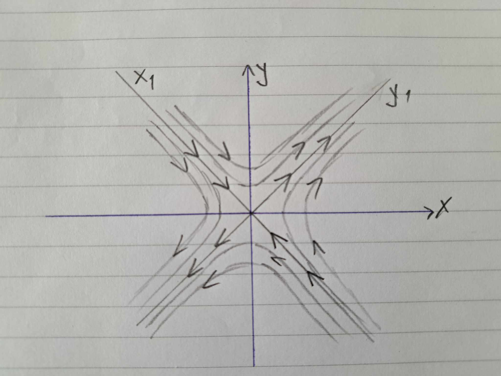

# Фазов портрет на автономна система

## Общ вид

Да се начертае фазов портрет на дадената автономната (тоест аргументът $t$ на функциите $x(t)$ и $y(t)$ не участва явно) система:

$$
\begin{cases}
\dot{x} = k_1x + k_2y + b_1 \newline
\dot{y} = k_3x + k_4y + b_2
\end{cases}
$$

$k_1, \space k_2, \space k_3, \space k_4, \space b_1, \space b_2 \in \mathbb{R}$

Обикновено в такива задачи $b_1 = b_2 = 0$ за простота.

## Алгоритъм за решаване

Намираме равновесните точки на автономната система. Тъй като тя е линейна, то очакваме да намерим точно 1 равновесна точка. Намираме ги от решенията на следната система:

$$
\begin{cases}
k_1x + k_2y + b_1 = 0 \newline
k_3x + k_4y + b_2 = 0
\end{cases}
$$

Нека равновесната точка е $(x_0, y_0)$.

Ако равновесната точка не е $(0, 0)$, което се случва когато $(b_1, b_2) \ne (0, 0)$, то ще сменим базиса така, че равновесната точка да бъде $(0 ,0)$. Тогава полагаме $x_2 = x - x_0$ и $y_2 = y - y_0$ и получаваме системата:

$$
\begin{cases}
\dot{x_1} = m_1x_1 + m_2y_1 \newline
\dot{y_1} = m_3x_1 + m_4y_1
\end{cases}
$$

Единствената равновесна точка е $(0, 0)$.

$$
A =
\begin{pmatrix}
    m_1 & m_2 \newline
    m_3 & m_4
\end{pmatrix}
$$

Намираме собствените стойности $\lambda_1, \lambda_2$ от

$$
P_A(\lambda) =
\begin{vmatrix}
    m_1 - \lambda & m_2 \newline
    m_3 & m_4 - \lambda
\end{vmatrix}
= 0
$$

Намираме собствените вектори $\overrightarrow{u}$ и $\overrightarrow{v}$ по следния начин:

$$(A-\lambda_1 E)\overrightarrow{u} = \overrightarrow{0}$$

$$u = \begin{pmatrix}u_1\newline u_2\end{pmatrix}$$

$$(A-\lambda_2 E)\overrightarrow{v} = \overrightarrow{0}$$

$$v = \begin{pmatrix}v_1\newline v_2\end{pmatrix}$$

Спрямо собствените стойности определяме ФСР

$$\text{ФСР} = \lbrace \phi_1, \space \phi_2 \rbrace = \lbrace e^{\lambda_{1}t}, \space e^{\lambda_{2}t} \rbrace$$

Записваме общото решение на авотномната система, което се задава по формулата (ако $\lambda_1 \ne \lambda_2$)

$$
\begin{pmatrix}
x_2 \newline y_2
\end{pmatrix}
= C_1 \phi_1 \overrightarrow{u} + C_2 \phi_2 \overrightarrow{v}
$$

В базиса $(\overrightarrow{u}, \overrightarrow{v})$ фазовите криви се задават по следния начин:

$$
\begin{cases}
    x_1 = C_1 \phi_{1} \newline
    y_1 = C_2 \phi_{2} \newline
    t \in \mathbb{R}
\end{cases}
$$

Проверяваме 4 случая

### I случай: $C_1 = C_2 = 0$

Тогава $(x_1, y_1) = (0, 0)$

### II случай: $C_1 = 0, \space C_2 \ne 0$

Тогава $(x_1, y_1) = (0, C_2 \phi_{2})$

Гледаме поведението на $C_2 \phi_{2}$ при $t \to \infty$

### III случай: $C_1 \ne 0, \space C_2 = 0$

Тогава $(x_1, y_1) = (C_1 \phi_{1}, 0)$

Гледаме поведението на $C_1 \phi_{1}$ при $t \to \infty$

### IV случай: $C_1 \ne 0, \space C_2 \ne 0$

Искаме да изразим връзката между $x$ и $y$ по един от два начина за някои $a, b \in \mathbb{N}$ и произволно $K \in \mathbb{R}$ и от изразяването определяме какви фазови криви чертаем:

* $y_1^a = K x^b$
  * Ако $a = b$, то чертаем прави
  * Ако $a < b$, то чертаем параболи като $y = Kx^2$
  * Ако $a > b$, то чертаем параболи като $x = Ky^2$
* $y_1^a = K\dfrac{1}{x^b}$
  * Чертаем хиперболи

Така ще начертаем фазов портрет в базиса $(\overrightarrow{u}, \overrightarrow{v})$. След това ще начертаем друг фазов портрет (ротиран) в базиса $(x_2, y_2)$ и накрая ще начертаем последен фазов портрет (транслиран) в базиса $(x, y)$.

Също така трябва да определим типа на равновесната точка спрямо собствените стойности:

* Реални собствени стойности
  * $\lambda_{1} < 0$ и $\lambda_{2} < 0 \implies$ устойчив възел
  * $\lambda_{1} > 0$ и $\lambda_{2} > 0 \implies$ неустойчив възел
  * $\lambda_{1} < 0$ и $\lambda_{2} > 0 \implies$ седло
* Комплексни собствени стойности
  * $Re(\lambda_{1, 2}) < 0 \implies$ устойчив фокус
  * $Re(\lambda_{1, 2}) > 0 \implies$ неустойчив фокус
  * $Re(\lambda_{1, 2}) = 0 \implies$ център

## Конкретен пример

Да се начертае фазов портрет на следната автономна система:

$$
\begin{cases}
\dot{x} = x + 2y \newline
\dot{y} = 2x + y
\end{cases}
$$

Намираме равновесните точки на автономната система. Тъй като тя е линейна, то очакваме да намерим точно 1 равновесна точка. Намираме ги от решенията на следната система:

$$
\begin{cases}
x + 2y = 0 \newline
2x + y = 0
\end{cases}
$$

Единствената равновесна точка е $(0, 0)$ и няма нъжда да сменяме базиса, въвеждайки $x_2$ и $y_2$

$$
A =
\begin{pmatrix}
    1 & 2 \newline
    2 & 1
\end{pmatrix}
$$

Намираме собствените стойности $\lambda_1, \lambda_2$ от

$$
P_A(\lambda) =
\begin{vmatrix}
    1 - \lambda & 2 \newline
    2 & 1 - \lambda
\end{vmatrix}
= 0
$$

$$(1-\lambda)^2-4 = 0$$

$$\lambda_1 = 3 \quad \lambda_2 = -1$$

Намираме собствените вектори $\overrightarrow{u}$ и $\overrightarrow{v}$ по следния начин:

$$(A-\lambda_1 E)\overrightarrow{u} = \overrightarrow{0}$$

```math
\begin{pmatrix}
    2 & 2 \newline 2 & 2
\end{pmatrix}
\begin{pmatrix}
    u_1 \newline u_2
\end{pmatrix}
=
\begin{pmatrix}
    0 \newline 0
\end{pmatrix}
```

$$u_2 = -u_1$$

```math
\overrightarrow{u}
=
\begin{pmatrix}
    u_1 \newline u_2
\end{pmatrix}
=
\begin{pmatrix}
    1 \newline -1
\end{pmatrix}
```

$$(A-\lambda_2 E)\overrightarrow{v} = \overrightarrow{0}$$

```math
\begin{pmatrix}
    -2 & 2 \newline 2 & -2
\end{pmatrix}
\begin{pmatrix}
    v_1 \newline v_2
\end{pmatrix}
=
\begin{pmatrix}
    0 \newline 0
\end{pmatrix}
```

$$v_2 = v_1$$

```math
\overrightarrow{v}
=
\begin{pmatrix}
    v_1 \newline v_2
\end{pmatrix}
=
\begin{pmatrix}
    1 \newline 1
\end{pmatrix}
```

Спрямо собствените стойности определяме ФСР

$$\text{ФСР} = \lbrace \phi_1, \space \phi_2 \rbrace = \lbrace e^{-t}, \space e^{3t} \rbrace$$

Записваме общото решение на авотномната система, което се задава по формулата (ако $\lambda_1 \ne \lambda_2$)

```math
\begin{pmatrix}
x_2 \newline y_2
\end{pmatrix}
= C_1 \phi_1 \overrightarrow{u} + C_2 \phi_2 \overrightarrow{v}
```

В базиса $(\overrightarrow{u}, \overrightarrow{v})$ фазовите криви се задават по следния начин:

$$
\begin{cases}
    x_1 = C_1 \phi_{1} = C_1 e^{-t} \newline
    y_1 = C_2 \phi_{2} = C_2 e^{3t} \newline
    t \in \mathbb{R}
\end{cases}
$$

Проверяваме 4 случая

### I случай: $C_1 = C_2 = 0$

Тогава $(x_1, y_1) = (0, 0)$

### II случай: $C_1 = 0, \space C_2 \ne 0$

Тогава $(x_1, y_1) = (0, C_2 e^{3t})$

Правата $x=0$ без точката $(0, 0)$

Гледаме поведението на $C_2 e^{3t}$ при $t \to \infty$

$$C_2 e^{3t} \underset{t \to \infty}{\to} \begin{cases}+\infty \quad & C_2>0 \newline -\infty \quad & C_2<0\end{cases}$$

### III случай: $C_1 \ne 0, \space C_2 = 0$

Тогава $(x_1, y_1) = (C_1 e^{-t}, 0)$

Гледаме поведението на $C_1 e^{-t}$ при $t \to \infty$

$$C_1 e^{-t} \underset{t \to \infty}{\to} 0$$

### IV случай: $C_1 \ne 0, \space C_2 \ne 0$

Искаме да изразим връзката между $x$ и $y$

$$
\begin{cases}
    x_1^3 = C_1^3 e^{-3t} \newline
    y_1 = C_2 e^{3t} \newline
    t \in \mathbb{R}
\end{cases}
$$

$$x_1^3y_1 = C_1^3C_2$$

$$y_1 = K \dfrac{1}{x_1^3}$$

Тази връзка означава, че фазовите криви ще бъдат хиперболи.

Собствените стойности са с различни знаци и съответно типа на равновесната точка е седло.

")


