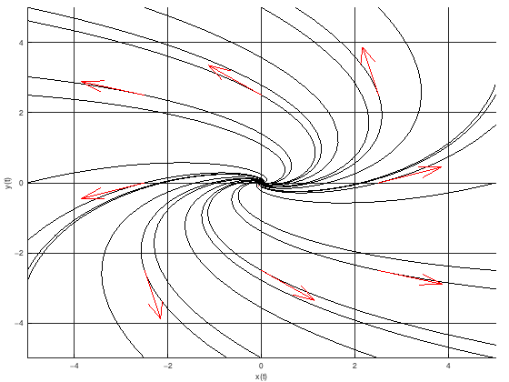
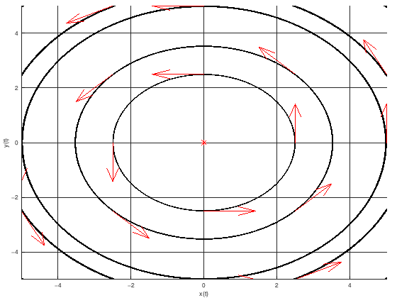

# Фазов портрет на автономна система

## Общ вид

Да се начертае фазов портрет на дадената автономната (тоест аргументът $t$ на функциите $x(t)$ и $y(t)$ не участва явно) система:

$$
\begin{cases}
\dot{x} = k_1x + k_2y + b_1 \newline
\dot{y} = k_3x + k_4y + b_2
\end{cases}
$$

$k_1, \space k_2, \space k_3, \space k_4, \space b_1, \space b_2 \in \mathbb{R}$

Обикновено в такива задачи $b_1 = b_2 = 0$ за простота.

**ТУК ПОЛУЧАВАМЕ ЕДИНСТВЕНА РАВНОВЕСНА ТОЧКА И СОБСТВЕНИТЕ СТОЙНОСТИ СА КОМПЛЕКСНО СПРЕГНАТИ**

## Алгоритъм за решаване

Намираме равновесните точки на автономната система. Намираме ги от решенията на следната система:

$$
\begin{cases}
k_1x + k_2y + b_1 = 0 \newline
k_3x + k_4y + b_2 = 0
\end{cases}
$$

Нека равновесната точка е $(x_0, y_0)$.

Ако равновесната точка не е $(0, 0)$, което се случва когато $(b_1, b_2) \ne (0, 0)$, то ще сменим базиса така, че равновесната точка да бъде $(0 ,0)$. Тогава полагаме $w = x - x_0$ и $z = y - y_0$ и получаваме системата:

$$
\begin{cases}
\dot{w} = k_1w + k_2z \newline
\dot{z} = k_3w + k_4z
\end{cases}
$$

(Ако не сме сменили базиса, то $w = x$ и $z = y$)

Единствената равновесна точка е $(0, 0)$.

$$
A =
\begin{pmatrix}
    k_1 & k_2 \newline
    k_3 & k_4
\end{pmatrix}
$$

Намираме собствените стойности $\lambda_1, \lambda_2$ от

$$
P_A(\lambda) =
\begin{vmatrix}
    k_1 - \lambda & k_2 \newline
    k_3 & k_4 - \lambda
\end{vmatrix}
= 0
$$

Получаваме комплексно спрегнати собствени стойности.

Определяме типa на равновесната точка спрямо собствените стойности:

* Комплексни собствени стойности
  * $Re(\lambda_{1, 2}) < 0 \implies$ устойчив фокус
  * $Re(\lambda_{1, 2}) > 0 \implies$ неустойчив фокус
  * $Re(\lambda_{1, 2}) = 0 \implies$ център

Така ще начертаем фазов портрет в базиса $(w, z)$. След това ще начертаем окончателен фазов портрет (транслиран) в базиса $(x, y)$.

## Конкретен пример

Да се начертае фазов портрет на следната автономна система:

$$
\begin{cases}
\dot{x} = 3x - 4y \newline
\dot{y} = x + 3y
\end{cases}
$$

Намираме равновесните точки на автономната система. Намираме ги от решенията на следната система:

$$
\begin{cases}
3x - 4y = 0 \newline
x + 3y = 0
\end{cases}
$$

Единствената равновесна точка е $(0, 0)$ и няма нужда да сменяме базиса, въвеждайки $w$ и $z$

$$
A =
\begin{pmatrix}
    3 & -4 \newline
    1 & 3
\end{pmatrix}
$$

Намираме собствените стойности $\lambda_1, \lambda_2$ от

$$
P_A(\lambda) =
\begin{vmatrix}
    3 - \lambda & -4 \newline
    1 & 3 - \lambda
\end{vmatrix}
= 0
$$

$$(3-\lambda)^2+4 = 0$$

$$\lambda_{1, 2} = 3 \pm 2i$$

$Re(\lambda_{1, 2}) > 0 \implies$ равновесната точка е неустойчив фокус

Фазов портрет от Матлаб:

## Конкретен пример 2

Да се начертае фазов портрет на следната автономна система:

$$
\begin{cases}
\dot{x} = -y \newline
\dot{y} = x
\end{cases}
$$

Намираме равновесните точки на автономната система. Намираме ги от решенията на следната система:

$$
\begin{cases}
-y = 0 \newline
x = 0
\end{cases}
$$

Единствената равновесна точка е $(0, 0)$ и няма нужда да сменяме базиса, въвеждайки $w$ и $z$

$$
A =
\begin{pmatrix}
    0 & -1 \newline
    1 & 0
\end{pmatrix}
$$

Намираме собствените стойности $\lambda_1, \lambda_2$ от

$$
P_A(\lambda) =
\begin{vmatrix}
    0 - \lambda & -1 \newline
    1 & 0 - \lambda
\end{vmatrix}
= 0
$$

$$\lambda^2+1 = 0$$

$$\lambda_{1, 2} = \pm i$$

$Re(\lambda_{1, 2}) = 0 \implies$ равновесната точка е център

Щом равновесната точка е център, то фазовите криви са елипси. Това, че коефициентът пред $i$ е единица, означава, че фазовите криви са окръжности.

Фазов портрет от Матлаб:

