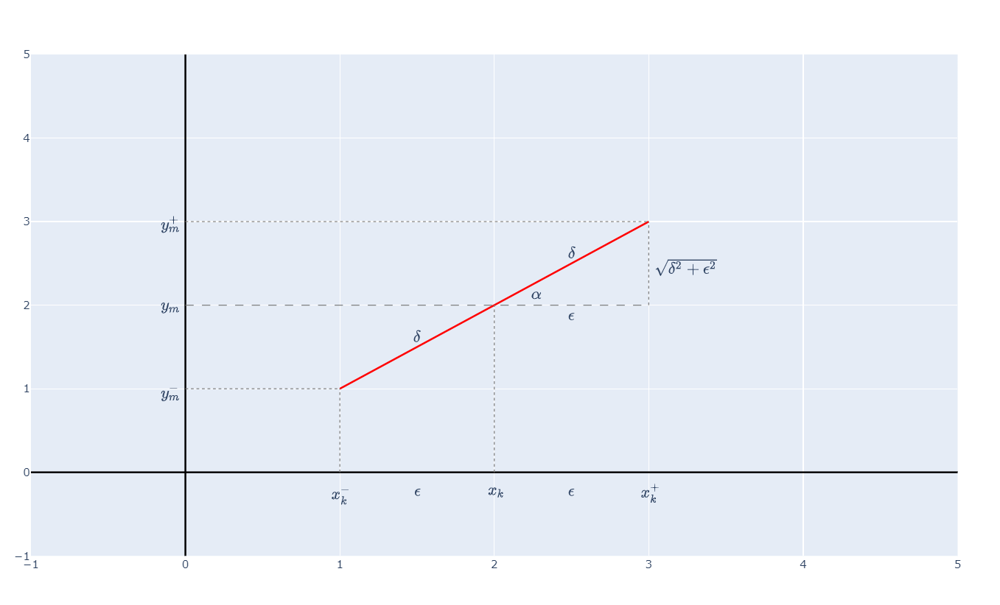

# Поле от прави

Нека имаме диференциално уравнение от вида $y' = f(x, y)$

Ще построим поле от прави за него.

Избираме си мрежа от точки в равнината.

За всяка точка $(x_k, y_m)$ от мрежата ще разглеждаме следната задача на Коши

$$
\begin{cases}
y' = f(x, y)\\
y(x_k) = y_m
\end{cases}
$$

Няма да я решаваме обаче.

Ще построим отсечка с фиксирана дължина, която да минава през точката $(x_k, y_m)$. Нека тази дължина е $2\delta$.

Ето код на Python за визуализация:

```python
import plotly
import plotly.graph_objects as go
from IPython.display import display, HTML

epsilon = 0.1075

fig = go.Figure()

fig.add_shape(type="line", x0=-1, x1=5, y0=0, y1=0, line=dict(color="black", width=2))
fig.add_shape(type="line", x0=0, x1=0, y0=-1, y1=5, line=dict(color="black", width=2))

fig.add_trace(go.Scatter(x=[1, 3], y=[1, 3], mode="lines", line=dict(color="red", width=2)))

fig.add_shape(type="line", x0=0, x1=1, y0=1, y1=1, line=dict(color="gray", width=1, dash="dot"))
fig.add_shape(type="line", x0=0, x1=3, y0=2, y1=2, line=dict(color="gray", width=1, dash="dash"))
fig.add_shape(type="line", x0=0, x1=3, y0=3, y1=3, line=dict(color="gray", width=1, dash="dot"))

fig.add_shape(type="line", x0=1, x1=1, y0=0, y1=1, line=dict(color="gray", width=1, dash="dot"))
fig.add_shape(type="line", x0=2, x1=2, y0=0, y1=2, line=dict(color="gray", width=1, dash="dot"))
fig.add_shape(type="line", x0=3, x1=3, y0=2, y1=3, line=dict(color="gray", width=1, dash="dot"))

fig.add_annotation(x=0-epsilon, y=1, text=r"$y_{m}^{-}$", showarrow=False, font=dict(size=16))
fig.add_annotation(x=0-epsilon, y=2, text=r"$y_{m}$", showarrow=False, font=dict(size=16))
fig.add_annotation(x=0-epsilon, y=3, text=r"$y_{m}^{+}$", showarrow=False, font=dict(size=16))

fig.add_annotation(x=1, y=0-2*epsilon, text=r"$x_{k}^{-}$", showarrow=False, font=dict(size=16))
fig.add_annotation(x=2, y=0-2*epsilon, text=r"$x_{k}$", showarrow=False, font=dict(size=16))
fig.add_annotation(x=3, y=0-2*epsilon, text=r"$x_{k}^{+}$", showarrow=False, font=dict(size=16))

fig.add_annotation(x=3+2*epsilon, y=(2+3)/2, text=r"$\sqrt{\delta^2 + \epsilon^2}$", showarrow=False, font=dict(size=16))

fig.add_annotation(x=(2+3)/2, y=2-1*epsilon, text=r"$\epsilon$", showarrow=False, font=dict(size=16))
fig.add_annotation(x=(1+2)/2, y=0-2*epsilon, text=r"$\epsilon$", showarrow=False, font=dict(size=16))
fig.add_annotation(x=(2+3)/2, y=0-2*epsilon, text=r"$\epsilon$", showarrow=False, font=dict(size=16))

fig.add_annotation(x=(2+3)/2, y=(2+3)/2+1.5*epsilon, text=r"$\delta$", showarrow=False, font=dict(size=16))
fig.add_annotation(x=(1+2)/2, y=(1+2)/2+1.5*epsilon, text=r"$\delta$", showarrow=False, font=dict(size=16))

fig.add_annotation(x=2+2.5*epsilon, y=2+1.35*epsilon, text=r"$\alpha$", showarrow=False, font=dict(size=16))

fig.update_layout(
    xaxis=dict(range=[-1, 5], zeroline=False),
    yaxis=dict(range=[-1, 5], zeroline=False),
    height=725,
)

fig.show()
```

Резултат:



Знаем, че $y'(x_k) = \tan{\alpha}$

Така наклонът и дължината на отсечката са еднозначно определени.

Остава да открием точни координати за точките $(x_k^+, y_m^+)$ и $(x_k^-, y_m^-)$. Те са симетрични и е достатъчно да намерим координатите само на една от двете точки - например $(x_k^+, y_m^+)$

Означаваме с $\epsilon$ разстоянието между $x_k$ и $x_k^+$

С Питагорова теорема намираме третата страна на правоъгълния триъгълник горе дясно.

От тригонометричното определени за тангенс $\tan{\alpha} = \dfrac{\sqrt{\delta^2 + \epsilon^2}}{\epsilon}$

$$
\begin{cases}
y'(x_k) = f(x_k, y_m)\\
y'(x_k) = \tan{\alpha}\\
\tan{\alpha} = \dfrac{\sqrt{\delta^2 - \epsilon^2}}{\epsilon}
\end{cases}
$$

Значи

$$f(x_k, y_m) = \dfrac{\sqrt{\delta^2 - \epsilon^2}}{\epsilon}$$

$$f(x_k, y_m)^2 = \dfrac{\delta^2 - \epsilon^2}{\epsilon^2}$$

$$f(x_k, y_m)^2 + 1= \dfrac{\delta^2}{\epsilon^2}$$

$$\epsilon^2= \dfrac{\delta^2}{f(x_k, y_m)^2 + 1}$$

$$\epsilon= \dfrac{\delta}{\sqrt{f(x_k, y_m)^2 + 1}}$$

Намерихме $\epsilon$ и съответно можем да намерим $x$-координатата $x_k^+ = x_k + \epsilon$

Остава да намерим и $y$-координатата. Ще я намерим по следния начин

$$y_m^+ - y_m = \sqrt{\delta^2-\epsilon^2} = \epsilon f(x_k, y_m)$$

Откъдето

$$y_m^+ = y_m + \epsilon f(x_k, y_m)$$
