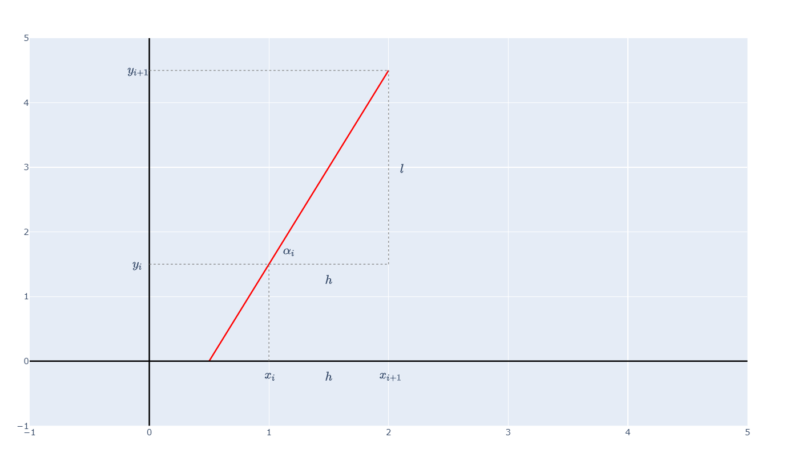

# Геометрична интерпретация

Ето код на Python за визуализация:

```python
import plotly
import plotly.graph_objects as go
from IPython.display import display, HTML

epsilon = 0.1075

fig = go.Figure()

fig.add_shape(type="line", x0=-1, x1=5, y0=0, y1=0, line=dict(color="black", width=2))
fig.add_shape(type="line", x0=0, x1=0, y0=-1, y1=5, line=dict(color="black", width=2))

fig.add_trace(go.Scatter(x=[0.5, 2], y=[0, 4.5], mode="lines", line=dict(color="red", width=2)))

fig.add_shape(type="line", x0=0, x1=2, y0=1.5, y1=1.5, line=dict(color="gray", width=1, dash="dot"))
fig.add_shape(type="line", x0=1, x1=1, y0=0, y1=1.5, line=dict(color="gray", width=1, dash="dot"))
fig.add_shape(type="line", x0=0, x1=2, y0=4.5, y1=4.5, line=dict(color="gray", width=1, dash="dot"))
fig.add_shape(type="line", x0=2, x1=2, y0=1.5, y1=4.5, line=dict(color="gray", width=1, dash="dot"))

fig.add_annotation(x=0-epsilon, y=1.5, text=r"$y_{i}$", showarrow=False, font=dict(size=16))
fig.add_annotation(x=0-epsilon, y=4.5, text=r"$y_{i+1}$", showarrow=False, font=dict(size=16))

fig.add_annotation(x=2+epsilon, y=(4.5+1.5)/2, text=r"$l$", showarrow=False, font=dict(size=16))

fig.add_annotation(x=1+3/2*epsilon, y=1.5+2*epsilon, text=r"$\alpha_{i}$", showarrow=False, font=dict(size=16))

fig.add_annotation(x=(1+2)/2, y=1.5-2*epsilon, text=r"$h$", showarrow=False, font=dict(size=16))
fig.add_annotation(x=(1+2)/2, y=0-2*epsilon, text=r"$h$", showarrow=False, font=dict(size=16))

fig.add_annotation(x=1, y=0-2*epsilon, text=r"$x_{i}$", showarrow=False, font=dict(size=16))
fig.add_annotation(x=2, y=0-2*epsilon, text=r"$x_{i+1}$", showarrow=False, font=dict(size=16))

fig.update_layout(
    xaxis=dict(range=[-1, 5], zeroline=False),
    yaxis=dict(range=[-1, 5], zeroline=False),
    height=725,
)

fig.show()
```

Резултат:



Допускаме, че $y_i$ е известно.

Ще покажем, че можем да намерим $y_{i+1}$

$x_i$ и $x_{i+1}$ са известни

Трябва да намерим $y_{i+1}$

От картинката горе виждаме, че тряябва да намерим "височината" на точката $(x_{i+1}, y_{i+1})$

Малко по-формално:

Имаме, че $y'(x_i) = f(x_i, y_i)$

Но също от геометричната интерпретация за производна имаме, че $y'(x_i) = \tan{\alpha_i}$

Така $\tan{\alpha_i} = f(x_i, y_i)$

С този ъгъл $\alpha_i$ еднозначно определяме как да начертаем червената права от картинката.

Получаваме един правоъгълен триъгълник. Хипотенузата е точно правата, определена от ъгъла $\alpha_i$. Единият катет е разстоянието между 2 възела, което сме определили да е точно $h$. Другият катет ще означим с $l$. $l$ е неизвестно и него търсим, понеже "височината" на точката $(x_{i+1}, y_{i+1})$, която търсехме е именно $y_i + l$

От тригонометричното определение за тангенс знаем, че $\tan{\alpha_i} = \dfrac{l}{h}$

Тогава

$
\begin{cases}
\tan{\alpha_i} = f(x_i, y_i) \\
\tan{\alpha_i} = \dfrac{l}{h}
\end{cases}
$

Значи

$\dfrac{l}{h} = f(x_i, y_i)$, тоест $l = h f(x_i, y_i)$

Така търсеното $y_{i+1}$ се задава със следната връзка:

$y_{i+1} = y_{i} + h f(x_i, y_i)$
